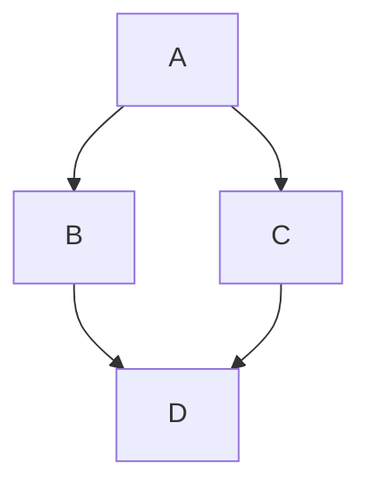

# Just the Docs — Local Reference

Compiled from https://just-the-docs.com and https://github.com/just-the-docs/just-the-docs
Last updated: 2026-06-25

This file is stored in `.claude/` which Jekyll excludes automatically (dot-prefixed directories are not copied to `_site`).

---

## Page Frontmatter Fields

```yaml
---
layout: page
title: My Page Title           # required; must be unique among siblings
nav_order: 3                   # integer or float; determines sidebar position
parent: Parent Page Title      # exact match to parent page's `title:` field
grand_parent: Grandparent Title # exact match; required when parent has its own parent
permalink: /section/slug/      # explicit URL; omit to use Jekyll default
has_toc: false                 # set false to suppress automatic child-page list on parent
nav_exclude: true              # hide page from sidebar (still accessible by URL)
search_exclude: true           # exclude from search index
---
```

### nav_order behaviour

- Numbers always sort before strings or omitted values.
- `nav_order` values can be reused across different parent hierarchies (scoped to siblings).
- When omitted, pages sort alphabetically by title (case-sensitive by default).
- To make sorting case-insensitive add `nav_sort: case_insensitive` to `_config.yml`.
- Floats and integers are equivalent (`10` == `10.0`).

### parent / grand_parent

- `parent` must match the target page's `title:` exactly (spacing, capitalisation).
- `grand_parent` is required to disambiguate when two pages in different branches share the same `parent` title, or when navigating three levels deep.
- `has_children` is redundant as of v0.10.0 — Just the Docs infers it automatically.

---

## Callouts

Callouts are configured in `_config.yml` and applied via kramdown block IALs.

### Configuration (already set in this site's _config.yml)

```yaml
callouts_level: quiet   # quiet (default, light theme) or loud (dark theme)
callouts:
  highlight:
    color: yellow
  important:
    title: Important
    color: blue
  new:
    title: New
    color: green
  note:
    title: Note
    color: purple
  warning:
    title: Warning
    color: red
```

### Single-paragraph callout (no title)

```markdown
{: .note }
A paragraph — gets the configured title ("Note") automatically.
```

```markdown
{: .warning }
Something that can break.
```

```markdown
{: .highlight }
An untitled highlight — no title shown because `highlight` has no `title:` configured.
```

### Single-paragraph callout with custom title

```markdown
{: .note-title }
> My Custom Title
>
> The paragraph content goes here.
```

Append `-title` to any callout type to override the title.

### Multi-paragraph callout

```markdown
{: .important }
> First paragraph.
>
> Second paragraph.
>
> Third paragraph.
```

### Multi-paragraph with custom title

```markdown
{: .important-title }
> My Important Title
>
> First paragraph.
>
> Second paragraph.
```

### Indented callout (inside a blockquote)

```markdown
> {: .highlight }
  A paragraph
```

### Nested callouts

```markdown
{: .important }
> {: .warning }
> A paragraph
```

### Opaque background (for nesting with visible border)

```markdown
{: .important }
> {: .opaque }
> <div markdown="block">
> {: .warning }
> A paragraph
> </div>
```

> **Note:** The callout markup can go either before or after its content block.

---

## Code Blocks

Always use fenced code blocks with a language identifier so Rouge applies syntax highlighting.

### Inline code

```markdown
Use `backticks` for inline code.
```

### Fenced blocks — common languages

````markdown
```bash
brew install httpd php mariadb
```

```php
define('DB_NAME', 'local_course_db');
```

```yaml
nav_order: 3
```

```js
const x = 1;
```

```python
print("hello")
```

```sql
SELECT * FROM users;
```

```ruby
puts "hello"
```

```html
<div class="container"></div>
```

```css
.my-class { color: red; }
```
````

### Mermaid diagrams (requires config)

Enable in `_config.yml`:
```yaml
mermaid:
  version: "9.1.3"
```

Then use:
````markdown

````

---

## Tables

Tables are responsive by default (horizontal scroll on overflow).

### Basic table

```markdown
| Column 1 | Column 2 | Column 3 |
|---|---|---|
| Value | Value | Value |
| Value | Value | Value |
```

### Table with alignment

```markdown
| Left         | Center            | Right  |
|:-------------|:-----------------:|-------:|
| left-aligned | center-aligned    | right  |
| text         | text              | text   |
```

- `:---` — left align
- `:---:` — center align
- `---:` — right align

---

## Typography & Layout Utilities

These are Utility classes applied via kramdown IAL `{: .class }`.

### Text size

```markdown
{: .fs-1 } through {: .fs-9 }
```

### Font weight

```markdown
{: .fw-300 }   Light
{: .fw-400 }   Normal
{: .fw-500 }   Medium
{: .fw-700 }   Bold
```

### Combined (common usage)

```markdown
Just the Docs is a flexible documentation theme for Jekyll.
{: .fs-6 .fw-300 }
```

### Labels / badges

```markdown
New
{: .label }

New (v0.4.0)
{: .label .label-green }
```

Label colours: `.label-blue`, `.label-green`, `.label-purple`, `.label-yellow`, `.label-red`

---

## TOC Block (standard pattern for all pages)

```markdown
# Page Title
{: .no_toc }

<details closed markdown="block">
  <summary>
    Table of contents
  </summary>
  {: .text-delta }
- TOC
{:toc}
</details>
```

- `{: .no_toc }` on the `# Title` heading excludes it from the TOC.
- The `<details>` block makes the TOC collapsible by default.
- `{:toc}` is the Jekyll/kramdown directive that generates the TOC list.

---

## Configuration Reference (key settings)

```yaml
# _config.yml

title: Site Title
theme: just-the-docs

# Callouts (see Callouts section above)
callouts_level: quiet
callouts:
  note:
    title: Note
    color: purple

# Search
search_enabled: true

# Aux links (top-right nav)
aux_links:
  "GitHub":
    - "//github.com/your-repo"
aux_links_new_tab: false

# Navigation
nav_enabled: true
nav_sort: case_insensitive   # optional

# Heading anchors
heading_anchors: true

# Footer
footer_content: "Your footer text here."

# Color scheme
color_scheme: light   # or dark

# Exclude files from build
exclude:
  - CLAUDE.md
  - blog-instructions.md
  - Gemfile
  - Gemfile.lock
```

---

## Minimal page layout

Add `layout: minimal` to a page's frontmatter to remove the sidebar and header — useful for landing pages.

---

## External navigation links

```yaml
# _config.yml
nav_external_links:
  - title: GitHub
    url: https://github.com/your-repo
    hide_icon: false
```

---

## Source

- Docs site: https://just-the-docs.com
- GitHub repo: https://github.com/just-the-docs/just-the-docs
- Callouts: https://just-the-docs.com/docs/ui-components/callouts/
- Navigation: https://just-the-docs.com/docs/navigation/
- Configuration: https://just-the-docs.com/docs/configuration/
