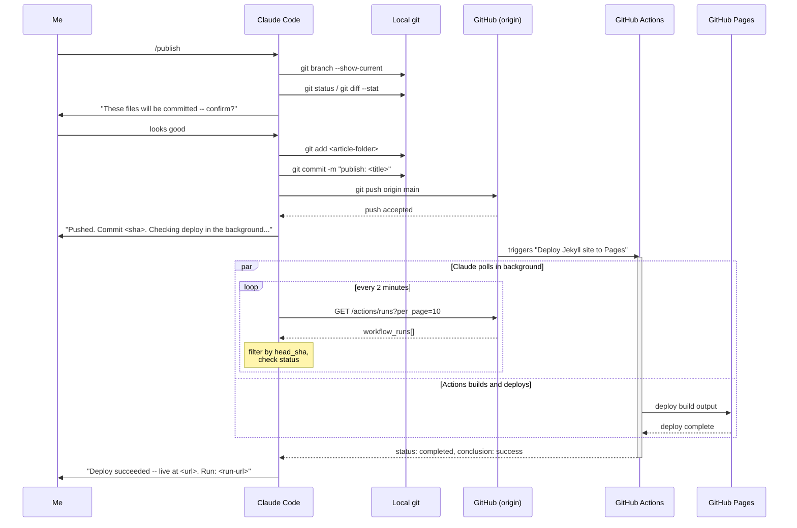

# Building a /publish Skill That Watches Its Own Deploy
{: .no_toc }

<details closed markdown="block">
  <summary>
    Table of contents
  </summary>
  {: .text-delta }
- TOC
{:toc}
</details>

In an [earlier post](/tech-adventures/jekyll-blog/automating-jekyll-blog-post-generation) I covered how I got Claude Code to generate this blog's articles correctly -- right folder, right `nav_order`, right frontmatter. That post stopped at "the article is written." It didn't cover what happens next: getting it from my local disk onto the actual live site, and knowing for sure that it landed.

That second half turned out to have its own small rabbit hole, which is what this post covers -- a Claude Code **custom slash command** (`/publish`) that commits and pushes an article, and then keeps watching GitHub in the background until it can tell me, definitively, "it's live" or "it broke."

## The problem: "pushed" isn't the same as "published"

For a while, my actual workflow after finishing an article was: `git add`, `git commit`, `git push`, then just... wait, and eventually refresh the blog in a browser tab. That works, but it has two real gaps:

1. **No confirmation loop.** A push can succeed while the deploy behind it still fails -- a broken Liquid tag, a missing image path, whatever. Nothing about `git push` tells you that.
2. **Manual babysitting.** Even when it works, someone has to remember to go check, and to know roughly how long to wait before checking.

The fix was to make this a proper Claude Code **skill** -- a markdown file under `.claude/commands/` that Claude Code treats as a slash command -- and to have that skill's last step be "prove the deploy actually worked," not just "assume it did because the push succeeded."

## What a Claude Code skill actually is here

Nothing exotic: `.claude/commands/publish.md` is a plain markdown file with numbered steps written in plain English (with embedded shell snippets). When I type `/publish`, Claude Code reads that file and follows it -- checking branches, staging specific paths, writing a commit message, and so on -- exactly like handing a checklist to a very literal colleague. The same pattern produced `/preview` (runs the local Jekyll dev server) and `/branch` (creates a feature branch before starting new article work) elsewhere in this repo.

The full file lives at `.claude/commands/publish.md`. Here's the current step list:

```
Step 1 — Verify branch          (must be on main)
Step 2 — Show pending changes   (git status / git diff --stat)
Step 3 — Stage the article      (git add <specific-path>, never -A)
Step 4 — Commit                 (descriptive "publish: <title>" message)
Step 5 — Push to origin/main    (triggers the GitHub Pages deploy)
Step 6 — Confirm the push       (commit hash, live URL, start Step 7)
Step 7 — Poll GitHub Actions    (background loop, reports success or failure)
```

Steps 1-6 are the "obvious" part. Step 7 is the part that took actual investigation.

## Finding the right thing to poll

My first instinct for Step 7 was GitHub's legacy Pages-builds endpoint:

```bash
curl -s "https://api.github.com/repos/walakaka77/test-doc-site/pages/builds/latest"
```

That returned a flat **404**. Rather than assume the endpoint was wrong in general, I checked what was actually deploying this repo, and found the answer sitting in the Actions tab: a GitHub Actions workflow named **"Deploy Jekyll site to Pages"**. This repo doesn't use the classic branch-based Pages build at all -- it deploys via Actions, which means the correct thing to poll is the *workflow runs* API, not the Pages-builds API:

```bash
curl -s "https://api.github.com/repos/walakaka77/test-doc-site/actions/runs?per_page=10"
```

{: .note }
This is a good example of a case where the fix wasn't "try harder with the same tool" -- it was recognizing the first endpoint was checking the wrong thing entirely for how this specific repo is configured. Two repos can both use "GitHub Pages" and be deployed by completely different mechanisms under the hood.

## The polling step itself

Step 7, verbatim from `.claude/commands/publish.md`, run as a **background** Bash command so it doesn't block anything else:

```bash
SHA=$(git rev-parse HEAD)
REPO="walakaka77/test-doc-site"
while true; do
  RESULT=$(curl -s "https://api.github.com/repos/$REPO/actions/runs?per_page=10" | python3 -c "
import json, sys
d = json.load(sys.stdin)
for r in d.get('workflow_runs', []):
    if r['head_sha'] == '$SHA':
        print(f\"{r['status']}|{r['conclusion']}|{r['html_url']}\")
        break
")
  if [ -n "$RESULT" ]; then
    STATUS=$(echo "$RESULT" | cut -d'|' -f1)
    if [ "$STATUS" = "completed" ]; then
      echo "$RESULT"
      break
    fi
  fi
  sleep 120
done
```

The loop is deliberately quiet: it prints nothing while the deploy is still `in_progress` or `queued`, and emits exactly one line -- `status|conclusion|html_url` -- the moment the run for *this specific commit SHA* reaches `completed`. That one line is what turns into the final report: which run, whether it was a `success` or a `failure`, and the URL to go look at directly.

{: .important }
Matching on `head_sha` specifically (not just "the latest run") matters here. If two pushes land close together, "the latest run" could easily be someone else's commit -- or, in a solo repo, an earlier push that's still finishing. Filtering by the exact SHA I just pushed is what makes the result trustworthy.

## Sequence: what actually happens end to end



The two branches in that `par` block are the important part: Claude Code isn't sitting there refreshing a page, and I'm not either. The push happens, GitHub Actions starts its own build independently, and the polling loop -- running as a detached background task -- checks in on it every two minutes until there's a real answer, then surfaces it as a single notification.

## What happens on failure

The same Step 7 covers the unhappy path, not just the happy one. If `conclusion` comes back as anything other than `success`, the skill doesn't just say "it failed" -- it pulls the specific job logs so I don't have to open GitHub myself:

```bash
curl -s "https://api.github.com/repos/walakaka77/test-doc-site/actions/runs/<run_id>/jobs" \
  | python3 -m json.tool
```

That response includes each job's steps and, for the failed one, enough context to point at *which* step broke (Jekyll build error, missing dependency, whatever it turns out to be) rather than a generic "something went wrong."

There's also a third outcome worth handling explicitly: the loop times out (15 minutes, generous against a normal ~1-2 minute deploy) without ever seeing `completed`. That's treated as its own distinct report -- "I couldn't confirm either way" -- rather than silently defaulting to "probably fine." Silence is not the same as success.

## Proof it works: a real run

The first time this ran for real, it confirmed a deploy that had, in fact, already finished by the time the check happened:

| Field | Value |
|---|---|
| Commit | `690271a957b900da49c64be7a9518bd2122236fe` |
| Workflow | Deploy Jekyll site to Pages |
| Status | `completed` |
| Conclusion | `success` |
| Started | `2026-07-13T05:19:54Z` |
| Finished | `2026-07-13T05:21:18Z` |
| Duration | ~1m24s |
| Run URL | `github.com/walakaka77/test-doc-site/actions/runs/29226058350` |

That table is pulled directly from the Actions API response for that push -- not reconstructed from memory or estimated from elapsed time.

## Why not simpler alternatives

| Approach | Why I didn't use it |
|---|---|
| Just wait ~60s and assume success | Doesn't catch actual build failures -- a broken Liquid tag or bad image path would deploy silently as "probably fine" |
| Poll the legacy Pages-builds API | 404s for this repo -- it isn't how this specific site deploys |
| Poll synchronously, blocking the whole `/publish` command | Ties up the conversation for up to 15 minutes for something that finishes in ~1-2 |
| Poll "the latest run" without checking `head_sha` | Risks matching a different commit's run if two pushes land close together |

{: .note }
Every one of these is a reasonable first instinct. The reason the final version differs from each is the same reason the earlier post's workflow took four attempts to land: the simplest version of "check if it worked" only actually holds up once you've tried it against the real system and found where it breaks.

## Files in this workflow

**`.claude/commands/publish.md`**
The skill itself -- the full step list, including the branch/staging/commit steps not covered in depth here, plus the polling and failure-reporting logic this post focuses on.

**`.claude/commands/branch.md`**
A related skill, invoked as `/branch`, that creates a feature branch before starting a new article or set of articles -- so drafts get reviewed in isolation before merging into `main` and running `/publish`.

**`CLAUDE.md`** (repo root)
Governs how articles themselves get written -- folder conventions, frontmatter, `nav_order` inference, formatting rules. `/publish` picks up *after* this is done; it doesn't touch content.

## Conclusion

The theme connecting this post and the [earlier one on article generation](/tech-adventures/jekyll-blog/automating-jekyll-blog-post-generation) is the same: don't trust a step just because it's supposed to have worked -- check it against the real system, and if the obvious check turns out to hit a 404, figure out why instead of writing that off as noise. `/publish` isn't just "commit and push" anymore. It's "commit, push, and don't stop until there's a real answer."

Until next time, peace and love!

## Images Required

This post is mostly code/diagram-driven, but a couple of real screenshots would round it out nicely:

| Filename | What to capture |
|---|---|
| `publish-skill-terminal.png` | Terminal output of `/publish` running through Steps 1-6 in Claude Code |
| `github-actions-run-success.png` | The GitHub Actions run page (`.../actions/runs/29226058350`) showing the green "Deploy Jekyll site to Pages" success state |
