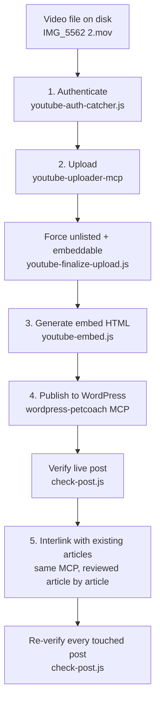

# Automating YouTube Uploads Into WordPress Blog Posts With Claude Code
{: .no_toc }

<details closed markdown="block">
  <summary>
    Table of contents
  </summary>
  {: .text-delta }
- TOC
{:toc}
</details>

I run an SEO content pipeline for a dog training site (petcoach.sg) almost entirely through Claude Code. A chunk of that pipeline is genuinely boring in a good way: an article gets a demo video, the video needs to land on YouTube unlisted-but-embeddable, the embed needs to go into the WordPress post as a real block, the post needs to publish, and then the whole thing needs checking, both the post itself and the links it makes to the rest of the site. I wanted to write down what that chain of tools actually looks like, because most of it turned out to hinge on a couple of API quirks that weren't obvious going in.

Everything below is from one real run: uploading a short clip of a dog named Storm fetching a ball, for an article called "How to Train Fetch for Obedience."

## The Pipeline, End to End

{: .highlight }
One video file on disk becomes one live WordPress post with a working embed and verified internal links, no manual copy-pasting anywhere in the middle.



Five real tools do the work: one MCP server for the YouTube side, one MCP server for the WordPress side, and three small Node scripts that exist specifically to patch the two gaps those MCP servers leave open. Nothing here is a single "run this and it does everything" script — it's Claude Code driving each tool in sequence and reading the output of one before deciding what to pass into the next.

## Step 1: Authenticating Against YouTube's API

The YouTube MCP server (`youtube-uploader-mcp`) needs an OAuth2 token before it can touch a channel. Getting that token the first time is the fiddliest part of this whole chain, for a reason that took a while to track down: an `invalid_grant` error on every single attempt, even with a valid account, valid scopes, and a valid authorization code.

{: .important }
The MCP server's `authenticate` tool builds the Google authorization URL from whatever `redirect_uri` you pass it. Its `accesstoken` tool, the one that actually exchanges the code for a token, **ignores that argument entirely** and always exchanges using the `redirect_uri` baked into the OAuth client's own credentials file at server startup. This project's client is a "Desktop app" type, which Google only lets register `http://localhost` (no port) as a redirect URI. Ask for a code with any other redirect (the MCP tool's own default is `https://localhost:8080`), and the exchange fails, even though every other part of the request was fine.

The fix is a small local server, `youtube-auth-catcher.js`, that listens on exactly `http://localhost`, no port, and does three things: builds the Google auth URL itself from the client credentials file, opens it in the default browser, and catches the redirect when it comes back.

```bash
sudo node tools/youtube-auth-catcher.js
```

It needs `sudo` because port 80 is privileged on macOS, and port 80 with no explicit port number is the only thing both sides of this OAuth exchange will agree on.


From there it's a normal Google sign-in flow: pick the account, review what the app is asking for, confirm.


{: .note }
The scopes here are broad on paper ("see, edit and permanently delete your YouTube videos") because that's the smallest scope bundle Google offers that still includes upload. In practice the only call this pipeline ever makes is a new video upload, followed by one settings tweak (see Step 2) — the extra permissions just come along for the ride.

### Getting the Code Back to Claude Without Watching a Terminal

Once Google redirects back to `http://localhost`, the auth-catcher server catches the authorization code — but it's running as a `sudo` process in a terminal Claude Code has no handle on, so there's no stdout for Claude to read directly. The workaround is a plain text file that the script writes the code into, cleared at the start of every run so a stale code never gets mistaken for a fresh one:

```
tools/.last-auth-code.txt
```


The script also fires a macOS notification once it's caught the code, so the actual human-in-the-loop part of this flow is just: approve access in the browser, then tell Claude to continue. Claude reads the code from that file and hands it to the MCP's `accesstoken` tool, which is the call that actually persists the token to `~/.youtube_uploader_channels_cache` for reuse.

{: .warning }
This step only runs when a channel needs a fresh token — a new channel, or a refresh token that's gone stale. For the run this article documents, a token from an earlier authorization was still cached and valid, so no browser consent screen appeared at all; the upload in Step 2 just used it directly. The screenshots above are the flow as it runs when a fresh authorization is genuinely needed, not something that happens on every single upload.

## Step 2: Uploading the Video

With a valid token cached, uploading is one MCP tool call:

```
upload_video({
  file_path: "research/target-ball-play-videos/IMG_5562 2.mov",
  channel_id: "UCEwbYKxhn2e0kxvnpTOsLYQ",  // Qiai Chong (Chief Behaviourist)
  title: "Storm's Fetch Return: Ball Play in Action",
  description: "Storm chases down the ball and brings it straight back...",
  tags: "dog training singapore, fetch training dogs, ...",
  category_id: "15",  // Pets & Animals
  status: "unlisted"
})
```

That returns a video ID (`JGO0MFbDjsg` for this run) almost immediately.

{: .warning }
`upload_video` accepts a `status` of `unlisted`, but that's the only visibility-related field it has. Checked directly against the MCP server's own source: neither `upload_video` nor its `update_video` tool ever sends an `embeddable` field to YouTube's API at all — `update_video` only handles playlists, subtitles, and thumbnails. There is no path to setting embeddability through this MCP server, full stop.

A second script, `youtube-finalize-upload.js`, closes that gap by calling the YouTube Data API directly for the one field the MCP can't touch:

```bash
node tools/youtube-finalize-upload.js JGO0MFbDjsg UCEwbYKxhn2e0kxvnpTOsLYQ
```

```json
{
  "uploadStatus": "uploaded",
  "privacyStatus": "unlisted",
  "license": "youtube",
  "embeddable": true,
  "publicStatsViewable": false
}
```

It reads the same token cache the MCP server maintains, refreshes it first if needed, and writes any refreshed token back — so the MCP server's own state never drifts out of sync with what this script touches. It's safe to run after every upload regardless of what `status` was passed initially, since it's idempotent.


## Step 3: Generating the WordPress Embed

Once a video is unlisted and embeddable, it needs to become a block of HTML that WordPress will actually render. A third script, `youtube-embed.js`, takes a video ID (or a full URL, in any of YouTube's usual formats) and prints the site's standard embed block:

```bash
node tools/youtube-embed.js JGO0MFbDjsg --title "Storm's Fetch Return: Ball Play in Action"
```

```html
<!-- wp:html -->
<div style="max-width: 560px; margin: 0 auto 1em;">
    <iframe
      title="Storm's Fetch Return: Ball Play in Action"
      src="https://www.youtube.com/embed/JGO0MFbDjsg?playsinline=0&cc_load_policy=0"
      width="100%"
      height="315"
      frameborder="0"
      allowfullscreen
      loading="lazy"
      referrerpolicy="strict-origin-when-cross-origin"
    ></iframe>
</div>
<!-- /wp:html -->
```

{: .note }
`playsinline=0` is deliberate, not a default left over from copy-pasting. On iOS it makes the embed jump to native fullscreen the moment someone taps play, instead of staying small inside the inline box. Getting this backwards (`playsinline=1`) produces the opposite of what it sounds like it should do — it forces small inline playback. There's no `autoplay` or `mute` param either; every embed on this site is a plain tap-to-play, not an autoplaying one.

The reason this needs its own script instead of a generic oEmbed block: WordPress's native `wp:embed` block can't take custom query params like `playsinline`, and has no vertical/portrait aspect-ratio option, only landscape presets. A raw `<iframe>` inside a `wp:html` block sidesteps both limits — and, checked directly rather than assumed, this WordPress install's API credentials have `unfiltered_html` capability, so the raw iframe markup survives a content push completely intact, no stripping.

That capability matters more than it might look like on the surface. A separate WordPress site in this same general problem space, publishing YouTube embeds through Elementor's Advanced Accordion widget instead of a REST API push, hit a case where this exact `referrerpolicy` attribute kept vanishing silently — not from `wp_kses` (confirmed via debug logging to already have it correctly whitelisted), but from the accordion plugin's own save-time HTML sanitization, a layer below `wp_kses` entirely. [Fixing YouTube Embed Error 153 in Elementor](/tech-adventures/wordpress/fixing-youtube-embed-error-153-elementor) is the full diagnosis. The REST API push used here never touches that save pipeline at all, which is the actual reason this attribute survives without a fight — not something to take for granted on a different site.


## Step 4: Publishing to WordPress, Then Verifying It

The WordPress side runs through a second MCP server (`wordpress-petcoach`) that wraps the site's REST API. The post gets created as a `draft` first, not published directly:

```
create-post({
  title: "How to Train Fetch for Obedience",
  content: "<!-- wp:paragraph --> ... <!-- wp:html --> ... ",
  status: "draft",
  slug: "fetch-training-dog-obedience",
  author_id: 15,
  categories: [41],
  featured_image_id: 10264,
  meta_title: "...",
  meta_description: "..."
})
```

A fresh fetch of that draft confirms the pushed content came back byte-identical before flipping `status` to `publish` — a cheap check that's worth doing every time, since a WordPress content push that reports success doesn't always mean the markup landed the way it was sent.

### The Checker Script

Once live, a read-only script, `check-post.js`, re-fetches the public page through WordPress's own REST API (no MCP, no credentials, just an HTTPS GET) and runs a fixed checklist against it:

```bash
node tools/check-post.js fetch-training-dog-obedience
```

```
[✓ PASS] Slug casing: All lowercase.
[✓ PASS] Post title length: 32 chars, within ≤45 target.
[✓ PASS] Excerpt length: 153 chars, within 150-200 target.
[✓ PASS] Author byline: "Shafik Walakaka (Certified Dog Trainer)"
[✓ PASS] Featured image: Set
[✓ PASS] SEO title length: 46 chars, within ≤60 target.
[✓ PASS] Meta description length: 153 chars, within 150-160 target.
[✓ PASS] Categories: Dog Training Foundation
[✓ PASS] Pending markers: None found.
[✓ PASS] Em-dash usage: None found.
[✓ PASS] Internal links: All 5 internal link(s) resolve (200).
[✓ PASS] /blog/ archive: Post link and title both found on the archive page.

13 pass, 1 warn, 0 fail.
```

{: .important }
The line that actually matters most here is **Internal links: All 5 internal link(s) resolve (200)**. The script pulls every internal `href` out of the live page's real HTML and fetches each one, checking for an actual `200`, not just checking that a link tag exists in the markup. That's the difference between "this post has links" and "this post's links go somewhere real" — and it's the exact class of problem a silent WordPress content-push corruption can cause without anything in the editor UI ever flagging it.


## Step 5: Interlinking With the Rest of the Site

A new post publishing cleanly isn't the end of the job — it also needs to actually connect to the site around it, and that part doesn't reduce to a script. For this run, that meant pulling every live post in the relevant WordPress category and reviewing each one as an explicit accept/reject decision, not a link quota to hit.

The strongest find wasn't planned going in: the new fetch-training article's opening drill (drop a treat, let the dog check in, walk backwards to trigger a chase, mark and reward on arrival) turned out to be the *exact* mechanic a separate recall-training article already documented, confirmed by checking both against a shared internal reference doc that codifies the site's training mechanics rather than trusting my own read of two articles that happened to sound similar. That became a genuine two-way link — recall's article now points to the fetch guide, and vice versa — instead of a link added just because two posts share a category.

{: .warning }
Every article touched during an interlinking pass, not just the new one, gets re-run through `check-post.js` afterward. Editing an older, already-published post to add one link is a small change, but it still goes through a full content overwrite on the WordPress side, and that's exactly the kind of edit worth re-verifying rather than assuming succeeded because the API call returned `success: true`.

## What This Doesn't Cover

Worth being upfront about the parts that stay manual. The initial browser consent step in Step 1 needs an actual human clicking through Google's UI — there's no way to make that step unattended, by design, since it's Google's own account-security flow. And the interlinking decisions in Step 5 are Claude reading article content and applying judgment, not a deterministic algorithm walking a link graph; a different session reviewing the same set of articles could reasonably reach a slightly different set of accepted links.

The `sudo`/port 80 requirement in Step 1 is also a workaround, not the ideal fix. The clean fix would be registering a "Web application" type OAuth client in Google Cloud Console instead of a "Desktop app" one, with a proper port-based redirect URI registered up front — that would let the MCP tool's own default redirect just work, no override, no catcher script, no `sudo`. Not done yet, since it means touching the Cloud Console client config directly rather than anything in this codebase.

## Key Takeaways

- The YouTube MCP's `accesstoken` tool ignores whatever `redirect_uri` you pass it — it always exchanges using the client credentials file's own registered value, which for a Desktop-type OAuth client is `http://localhost` with no port
- `sudo` is required only because port 80 is privileged, not because anything about this flow inherently needs elevated access
- A `sudo` process's stdout is invisible to Claude Code, so the authorization code gets relayed through a small gitignored text file instead of being read from the terminal directly
- The YouTube MCP server can set a video `unlisted`, but has no path to `embeddable` at all — that field only gets set by calling the YouTube Data API directly
- `playsinline=0` on a YouTube embed is what triggers native iOS fullscreen on tap; it's easy to get backwards and end up with the opposite behavior
- A `wp:html` block with a raw `<iframe>` survives a WordPress content push completely intact when the account has `unfiltered_html` — worth confirming rather than assuming on any new site
- Checking that a post "looks right" in the editor isn't the same as checking that its internal links actually resolve to `200` on the live site — that's a separate, scriptable check worth automating
- The best interlinking finds come from checking whether two articles use the *same underlying mechanic*, not from skimming for topical overlap

---

Until next time, peace and love!
