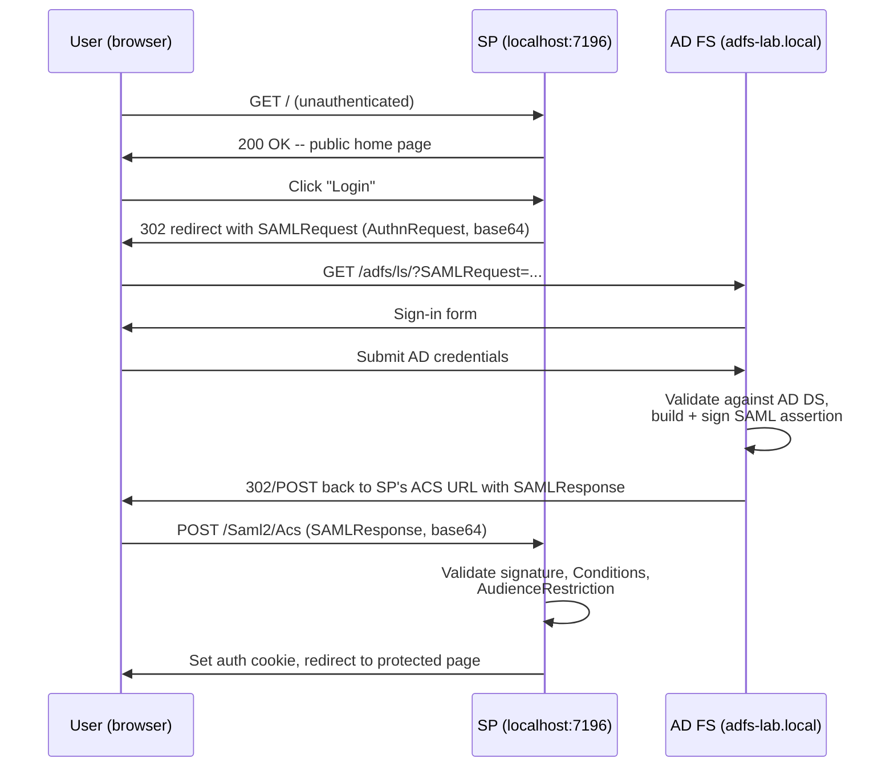

# Walking Through a Test SAML App, Step by Step
{: .no_toc }

<details closed markdown="block">
  <summary>
    Table of contents
  </summary>
  {: .text-delta }
- TOC
{:toc}
</details>

With AD FS running and verified in the [previous two posts](/tech-adventures/third-party-integrations/adfs-verifying-troubleshooting), the last piece is a real Service Provider to test the full browser redirect flow against. This project uses the [Sustainsys.Saml2](https://github.com/Sustainsys/Saml2) library's official ASP.NET Core sample app, configured with a minimal amount of code -- most of the "work" is just correctly pointing it at the IdP.

## The SP configuration

Everything relevant lives in `Program.cs`:

```csharp
builder.Services.AddAuthentication(opt =>
{
    // Default scheme that maintains session is cookies.
    opt.DefaultScheme = CookieAuthenticationDefaults.AuthenticationScheme;

    // If there's a challenge to sign in, use the Saml2 scheme.
    opt.DefaultChallengeScheme = Saml2Defaults.Scheme;
})
    .AddCookie()
    .AddSaml2(opt =>
    {
        // Set up our EntityId, this is our application.
        opt.SPOptions.EntityId = new EntityId("https://localhost:7196/Saml2");

        // Add an identity provider.
        opt.IdentityProviders.Add(new IdentityProvider(
            new EntityId("http://adfs-lab.local/adfs/services/trust"),
            opt.SPOptions)
        {
            // Load config parameters from metadata, using the Entity Id as the metadata address.
            LoadMetadata = true,
            MetadataLocation = "https://adfs-lab.local/FederationMetadata/2007-06/FederationMetadata.xml",
        });
    });
```

Three values do all the work:
- `opt.SPOptions.EntityId` -- this SP's own identifier. It must be registered as the Relying Party Identifier on the AD FS side (covered in the [setup post](/tech-adventures/third-party-integrations/adfs-setting-up-server)) *exactly*, scheme included.
- The `EntityId` passed to `IdentityProviders.Add` -- the IdP's entity ID, taken straight from `<EntityDescriptor entityID="...">` in the federation metadata -- **not** the federation service hostname.
- `MetadataLocation` with `LoadMetadata = true` -- pulls the IdP's signing cert and SSO endpoint live from the metadata URL, rather than pinning them statically. This is what makes the SP resilient to AD FS rotating its signing certificate later.

Cookie auth handles the SP's own session once the user is authenticated; the `Saml2Defaults.Scheme` challenge is what triggers the redirect to AD FS whenever an unauthenticated user hits a page requiring login.

## The flow, end to end



## Step by step, with screenshots

**1. Home page loads, unauthenticated.**

The app is just running -- no SAML interaction has happened yet.


**2. Clicking Login redirects to the IdP with a SAML AuthnRequest.**

The browser is sent to AD FS's login endpoint (`/adfs/ls/`) with a `SAMLRequest` query parameter -- a base64-encoded, deflate-compressed XML `AuthnRequest` that includes the SP's entity ID and the URL it wants the response sent back to (the ACS URL).


**3. Sign in with a domain account.**

This is a normal AD FS forms-based sign-in -- `DOMAIN\username` (or UPN) and password, validated against AD DS. Nothing SP-specific happens at this step; it's exactly the same prompt regardless of which relying party initiated the request.


**4. AD FS redirects back with a signed SAMLResponse.**

On success, AD FS POSTs the browser back to the SP's Assertion Consumer Service (ACS) endpoint (`/Saml2/Acs`) with a `SAMLResponse` form field. This is visible in DevTools' Network tab under the `Acs` request's Payload:


Decoded, the response looks like this (values shown are placeholders):

```xml
<samlp:Response Destination="https://localhost:7196/Saml2/Acs"
                 InResponseTo="id125271a5..." IssueInstant="...">
  <Issuer>http://adfs-lab.local/adfs/services/trust</Issuer>
  <samlp:Status><samlp:StatusCode Value="urn:oasis:names:tc:SAML:2.0:status:Success"/></samlp:Status>
  <Assertion>
    <Issuer>http://adfs-lab.local/adfs/services/trust</Issuer>
    <ds:Signature>...</ds:Signature> <!-- validated against the IdP's signing cert -->
    <Subject>...</Subject>
    <Conditions NotBefore="..." NotOnOrAfter="...">
      <AudienceRestriction><Audience>https://localhost:7196/Saml2</Audience></AudienceRestriction>
    </Conditions>
    <AttributeStatement>
      <Attribute Name="sAMAccountName"><AttributeValue>demo.user</AttributeValue></Attribute>
      <Attribute Name="userPrincipalName"><AttributeValue>demo.user@adfs-lab.local</AttributeValue></Attribute>
      <Attribute Name="mail"><AttributeValue>demo.user@example.com</AttributeValue></Attribute>
      <Attribute Name="displayName"><AttributeValue>Demo User</AttributeValue></Attribute>
    </AttributeStatement>
  </Assertion>
</samlp:Response>
```

The claim set here (`sAMAccountName`, `userPrincipalName`, `mail`, `displayName`, ...) is exactly what the "issue all claims" rule from the [setup post](/tech-adventures/third-party-integrations/adfs-setting-up-server) produces -- every configured AD attribute passed straight through.

**5. The SP validates the response and starts a session.**

Once `Program.cs`'s SAML middleware validates the signature, the `Conditions` (`NotBefore`/`NotOnOrAfter`/`AudienceRestriction`), and the `InResponseTo` correlation back to the original request, it issues the app's own cookie via `CookieAuthenticationDefaults.AuthenticationScheme` and the user lands back on the originally-requested page, now authenticated.

## What to check if any step doesn't match

- Stuck before step 2 (no redirect happens) → auth challenge scheme isn't wired up; check the page/endpoint actually requires the `Saml2Defaults.Scheme` challenge.
- Step 2 goes to the wrong host, or fails to resolve → `MetadataLocation` / IdP entity ID mismatch, or a DNS problem.
- Step 4 never happens (IdP shows its own error before redirecting back) → RP trust misconfiguration on the AD FS side (wrong Relying Party Identifier, or the ACS URL from the AuthnRequest doesn't match what's registered).
- Step 5 fails (SP rejects a response that step 4 clearly delivered) → audience mismatch, clock skew, or a stale signing cert -- the next post covers each of these in depth.

## What's next in this series

That's the full happy path working end to end. The next post covers the failure modes that actually show up in practice -- DNS reachability, HTTP vs HTTPS, entity ID mismatches, stale signing certs, clock skew, and downstream user provisioning -- with real examples of what they look like when they happen.

Until next time, peace and love!
