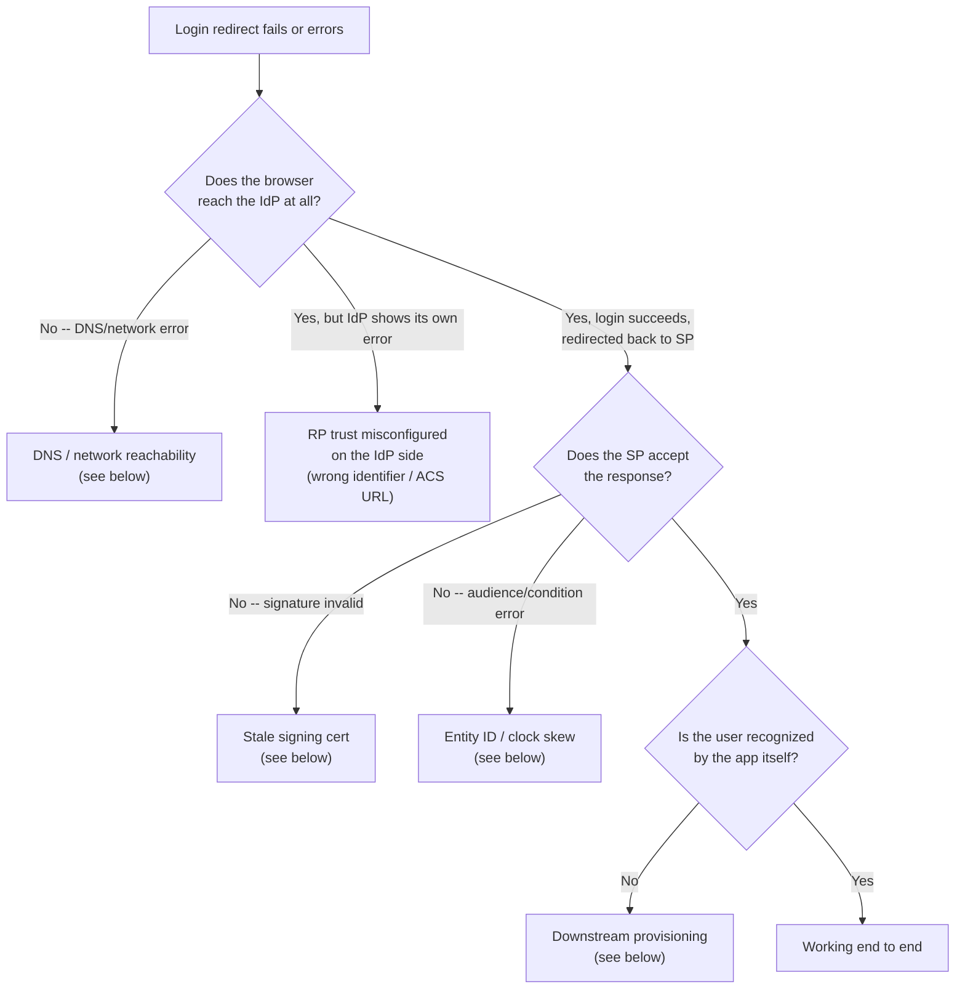

# Common ADFS/SAML Issues and How to Fix Them
{: .no_toc }

  

    Table of contents
  

  {: .text-delta }
- TOC
{:toc}

The flow in the [previous post](/tech-adventures/third-party-integrations/adfs-saml-app-walkthrough) works cleanly once everything is configured correctly -- but almost none of the failures below show up as an obvious "SAML" error. Most of them look like a generic browser error or a silent redirect failure, and the fix is usually outside the SAML config entirely. This is a rundown of the failures actually hit while building this integration, generalized so they apply to any AD FS/SP pairing.

## Decision tree: where in the flow did it break?

## 1. DNS / network reachability to the IdP

**Symptom**: clicking Login redirects the browser to the IdP's hostname, and the browser shows its own connectivity error rather than anything SAML-related -- `DNS_PROBE_FINISHED_NXDOMAIN` in Chrome, or an equivalent "can't reach this page."

This is not a SAML or SP config problem -- the redirect itself is correct (note the well-formed `SAMLRequest` visible in the URL), the browser simply cannot resolve the IdP's hostname from wherever it's running. This is the single most common failure when an SP gets deployed somewhere new (a UAT environment, a colleague's machine, a CI runner) that isn't on the same network/VPN as the IdP.

The tell that it's environment-specific rather than app-specific: the SP itself is running fine -- only the redirect *target* is unreachable.

{: .important }
**Fix**: confirm whatever machine/network the SP (or the browser testing it) runs on can actually resolve and reach the IdP's hostname -- `nslookup`/`curl` the federation metadata URL from that exact environment before assuming anything is wrong with the SAML configuration. IdP hostnames on internal networks are frequently only resolvable from within a VPN or intranet -- this is expected, not a bug, but it does mean "works on my machine" doesn't guarantee "works in the deployed environment."

## 2. HTTP vs HTTPS

Several AD FS configurations will silently reject, or behave inconsistently with, a relying party served over plain HTTP. If a login flow that works over `https://` fails as soon as the SP is accessed over `http://` (or vice versa -- an entity ID registered with `https://` won't match a runtime scheme of `http://`), that's the first thing to check -- not a deeper certificate or claims issue.

**Fix**: run the SP over HTTPS end to end during testing, and make sure the entity ID configured in code matches the scheme actually used at runtime exactly.

## 3. Entity ID / Audience mismatch

The SAML response's `<Conditions><AudienceRestriction><Audience>` must match the SP's configured `EntityId` **exactly**, including scheme. A trailing slash, an `http` vs `https` mismatch, or a leftover entity ID from an earlier environment (e.g. still `https://localhost:7196/Saml2` in a UAT deployment) will cause the SP to reject an otherwise perfectly valid, correctly-signed response.

**Fix**: whenever an SP's URL changes across environments, update both the SP's own `EntityId` config *and* the Relying Party Identifier registered on the IdP side in the same change -- treat them as one value that happens to be stored in two places.

## 4. Stale signing certificate

If signature validation starts failing on responses that used to validate fine, the most likely cause is the IdP rotating its token-signing certificate. This is exactly why `LoadMetadata = true` (covered in the [walkthrough post](/tech-adventures/third-party-integrations/adfs-saml-app-walkthrough)) matters -- an SP pinned to a static, previously-exported certificate will start failing the moment the IdP rotates, with no config change on the SP side to explain it.

**Fix**: prefer loading IdP metadata from a live URL over pinning a static certificate file, so certificate rotation on the IdP side doesn't require a corresponding SP deployment.

## 5. Clock skew / response validity window

Every SAML assertion carries a tight validity window (`NotBefore`/`NotOnOrAfter` -- often as short as one hour). If the SP host's clock is meaningfully out of sync with the IdP's, valid-looking responses get rejected as expired or not-yet-valid, and the error message rarely says "clock skew" directly.

**Fix**: verify both hosts have NTP/time sync enabled and are within a few seconds of each other before spending time on anything else, if responses are being rejected despite everything else about them looking correct.

## 6. Downstream user provisioning

A SAML response validating successfully only proves the *identity* is authenticated -- most real applications still need to map that identity to a local user/account record (matching, for example, on the `sAMAccountName` or `userPrincipalName` claim) before the user can actually do anything in the app. If login "succeeds" per the browser but the user lands on an access-denied or generic error page inside the app itself, the SAML handshake almost certainly worked and the problem is in that mapping step -- check whether the authenticated identity has a corresponding local account before re-investigating the SAML configuration.

**Fix**: seed or provision a local account for every test identity *before* testing login, and treat "authenticated by the IdP" and "recognized by the app" as two separate things to verify independently.

## Closing thoughts on the series

That covers the full loop: standing up an IdP, verifying it independently, running a real SP against it end to end, and the failure modes that actually show up in practice. The pattern generalizes past AD FS specifically -- most of it applies to any SAML2 IdP/SP pairing, and the same "which side of the handshake actually broke" decision tree is worth reaching for any time a login flow fails in a way that doesn't obviously say why.

Until next time, peace and love!
