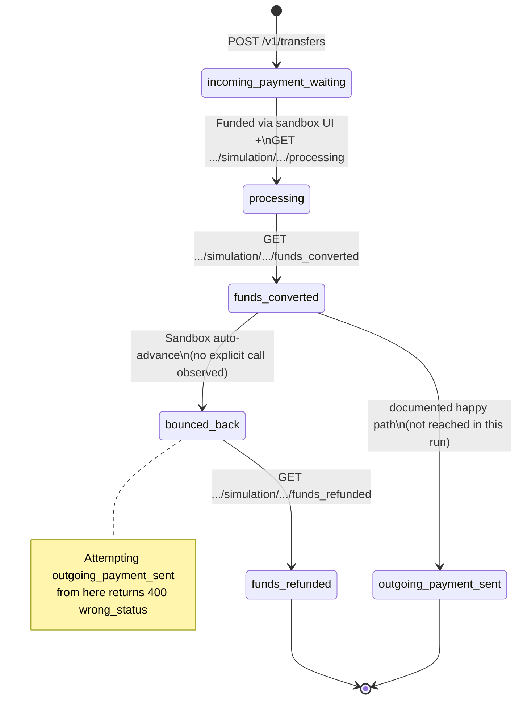

# Walking the Full Transfer State Machine: Happy Path, a Sandbox Surprise, and a Refund
{: .no_toc }

<details closed markdown="block">
  <summary>
    Table of contents
  </summary>
  {: .text-delta }
- TOC
{:toc}
</details>

Earlier in this series, [I reconciled specific pieces of Wise Platform's documented behavior against the sandbox](/tech-adventures/third-party-integrations/sandbox-vs-docs-reconciliation) -- quote expiry, rate expiry, idempotency, a fee mystery. Those were narrow, single-variable experiments. This post is different: it's one continuous run through the actual **transfer state machine**, from creation all the way to a terminal state, using the Wise sandbox UI, Postman, and a live webhook subscription together. It also includes something I didn't plan for: the sandbox itself changed the outcome mid-test, which turned out to be more interesting than the happy path I'd set out to document.

**Environment**: Wise Platform API, Sandbox V2 (`https://api.wise-sandbox.com`), sandbox UI at `wise-sandbox.com`
**Flow**: SGD → GBP, personal profile, `BANK_TRANSFER` payOut
**Profile**: `29263618` ("Giovanny Ramirez", personal -- KYC cleared; the business profile `29263621` on this account has unresolved KYC and returns 404 on `GET /v3/profiles/{id}/kyc-reviews`, so all testing here uses the personal profile)

## What I set out to test vs. what actually happened

The documented happy path for a Wise transfer is:

```
incoming_payment_waiting → processing → funds_converted → outgoing_payment_sent
```

I got three steps into it, then the sandbox auto-advanced the transfer to `bounced_back` on its own, mid-test, while I was setting up a webhook subscription. That's not a state in the documented happy path at all -- it's part of the *unhappy* path. Rather than treat that as a failed test, I followed it through to see where it led, which meant I ended up validating both directions in a single run:

```
incoming_payment_waiting → processing → funds_converted → [sandbox auto-advance] → bounced_back → funds_refunded
```

## Setup: profile, quote, recipient

### Collection variables


| Variable | Value | Set by |
|---|---|---|
| `baseUrl` | `https://api.wise-sandbox.com` | Collection default (V2) |
| `profileId` | `29263618` | Step 1 -- Get Profiles |
| `quoteId` | `7ddf698f-2d1a-4214-8f50-fb464c9f3c76` | Step 2 -- Create Quote |
| `quoteExpiry` | `2026-07-13T03:57:19Z` | Step 2 -- `expirationTime` |
| `recipientAccountId` | `701194571` | Step 3 -- List Recipients |
| `transferId` | `2147799796` | Step 4 -- Create Transfer |
| `customerTransactionId` | `425db72e-6cb9-4353-baa4-424a49f86e4f` | Step 4 -- idempotency key |
| `balanceId` | `303981` | Step 4.1a -- Get Balance ID |

### Profile

`GET /v1/profiles`


```json
{
  "id": 29263618,
  "type": "personal"
}
```

Cross-checked against the sandbox console -- same personal account, "Giovanny Ramirez":


### Quote

`POST /v3/profiles/29263618/quotes`

```json
{
  "sourceCurrency": "SGD",
  "targetCurrency": "GBP",
  "sourceAmount": 200,
  "payOut": "BANK_TRANSFER"
}
```


| Field | Value |
|---|---|
| `id` | `7ddf698f-2d1a-4214-8f50-fb464c9f3c76` |
| `rate` | `0.577594` |
| `createdTime` | `2026-07-13T03:27:19Z` |
| `expirationTime` | `2026-07-13T03:57:19Z` (30 min) |
| `rateExpirationTime` | `2026-07-15T03:27:19Z` (4 days) |
| `rateType` | `FIXED` |

Consistent with what I found in the [rate-expiry experiments](/tech-adventures/third-party-integrations/sandbox-vs-docs-reconciliation) -- `expirationTime` is exactly 30 minutes after `createdTime`, `rateExpirationTime` exactly 4 days after.

### Recipient

`GET /v1/accounts?profile=29263618`


| Field | Value |
|---|---|
| `id` | `701194571` |
| `accountHolderName` | Test UK Recipient TWo |
| `currency` | GBP |
| IBAN | `DE89 3704 0044 0532 0130 00` |
| BIC/SWIFT | `COBADEFFXXX` |

## Creating the transfer

`POST /v1/transfers`

```json
{
  "targetAccount": 701194571,
  "quoteUuid": "7ddf698f-2d1a-4214-8f50-fb464c9f3c76",
  "customerTransactionId": "425db72e-6cb9-4353-baa4-424a49f86e4f",
  "details": {
    "reference": "walakaka"
  }
}
```


```json
{
  "id": 2147799796,
  "quoteUuid": "7ddf698f-2d1a-4214-8f50-fb464c9f3c76",
  "status": "incoming_payment_waiting",
  "rate": 0.577594,
  "sourceCurrency": "SGD",
  "sourceValue": 191.60,
  "targetCurrency": "GBP",
  "targetValue": 110.67,
  "customerTransactionId": "425db72e-6cb9-4353-baa4-424a49f86e4f"
}
```

The sandbox UI reflects this immediately as "Waiting for you to pay":


{: .note }
Watch `sourceValue`/`targetValue` here -- at creation they're `191.60`/`110.67`, based on an *estimated* fee. A few steps down, once funding actually happens, they shift slightly to `191.75`/`110.75`. That's not a bug -- it's the same pattern I found in the earlier fee investigation, except this time it's small and fully explained: the estimate assumed an 8.40 SGD fee, and the payment method actually selected at funding time (`Your account`, 8.25 SGD) finalizes at a slightly different number.

## Funding via the sandbox UI

The V2 sandbox's `POST /v3/profiles/{id}/transfers/{id}/payments` endpoint returns 403 -- a known V2 limitation I ran into in the [previous post](/tech-adventures/third-party-integrations/paynow-kyc-open-questions) as well. The workaround is funding through the sandbox UI directly.


| UI field | Value |
|---|---|
| You send exactly | 200 SGD |
| Total fees (included) | 8.25 SGD |
| Total amount we'll convert | 191.75 SGD |
| Guaranteed rate | 1 SGD = 0.5776 GBP |
| Recipient gets | 110.75 GBP |

After clicking "Finish and pay", the UI moves to "Sending" and shows a guaranteed-rate banner:


> *"You have a guaranteed rate of 1 SGD = 0.5776 GBP."*

## Advancing the state machine

### `processing`

`GET /v1/simulation/transfers/2147799796/processing`


```json
{
  "id": 2147799796,
  "status": "processing",
  "rate": 0.577594,
  "sourceCurrency": "SGD",
  "sourceValue": 191.75,
  "targetCurrency": "GBP",
  "targetValue": 110.75
}
```

Calling this advanced the transfer from `incoming_payment_waiting` straight to `processing`, and it stayed there -- no further auto-advance at this point. Confirmed with a follow-up status check:


### `funds_converted`

`GET /v1/simulation/transfers/2147799796/funds_converted`


```json
{
  "id": 2147799796,
  "status": "funds_converted",
  "rate": 0.577594,
  "sourceCurrency": "SGD",
  "sourceValue": 191.75,
  "targetCurrency": "GBP",
  "targetValue": 110.75
}
```

Three steps into the documented happy path, exactly as expected. This is where things stopped going according to plan.

## The sandbox surprise: an uninvited jump to `bounced_back`

While the transfer sat in `funds_converted`, I set up a webhook subscription via [webhook.site](https://webhook.site) to capture state-change events for the rest of the run. By the time that setup was done, the transfer had moved to `bounced_back` on its own -- **no simulation call, no API request, nothing on my end triggered it.**

```json
{
  "id": 2147799796,
  "status": "bounced_back",
  "rate": 0.577594,
  "sourceCurrency": "SGD",
  "sourceValue": 191.75,
  "targetCurrency": "GBP",
  "targetValue": 110.75
}
```


{: .important }
I can't find this behavior documented anywhere in Wise's [simulation API reference](https://docs.wise.com/api-reference/simulation/simulationtransferstatechange) or the [transfer statuses guide](https://docs.wise.com/guides/product/send-money/tracking/transfer-statuses). My working theory, based purely on observing it happen: the sandbox auto-advances a transfer sitting in `funds_converted` to `bounced_back` after some period of inactivity, specifically so testers can exercise the unhappy path without needing partner-level access to trigger it deliberately. I can't confirm the exact trigger (a fixed timer vs. some other condition), only that it happened during the webhook setup window with zero explicit calls from me.

I tried to continue toward the happy-path terminal state anyway, to see if it was recoverable:

`GET /v1/simulation/transfers/2147799796/outgoing_payment_sent`


**400 Bad Request:**

```json
{
  "errors": [
    {
      "code": "wrong_status",
      "message": "Transfer needs to be in state 'funds_converted' before this action. You cannot change transfer from state 'BOUNCED_BACK' to state 'funds_converted'."
    }
  ]
}
```

It isn't recoverable. Once a transfer has been auto-advanced to `bounced_back`, the state machine enforces its ordering just as strictly as it did in [the KYC-gated block from earlier in this series](/tech-adventures/third-party-integrations/postman-cross-border-transfer-testing) -- there's no going back to simulate the happy-path continuation from here. The only way forward is down the unhappy path.

## Following the unhappy path to a refund

`GET /v1/simulation/transfers/2147799796/funds_refunded`


```json
{
  "id": 2147799796,
  "status": "funds_refunded",
  "rate": 0.577594,
  "sourceCurrency": "SGD",
  "sourceValue": 191.75,
  "targetCurrency": "GBP",
  "targetValue": 110.75
}
```

The sandbox UI reflects this as a cancellation, not a distinct "refunded" label:


> Status: **Cancelled** -- *"Your money's been refunded. We started your refund on July 13. Refunds usually take 3-5 working days."*

This is the same UI-label-vs-API-status gap I flagged in the earlier reconciliation post, just on the unhappy path this time: the API's terminal state is `funds_refunded`, but nothing in the UI ever displays that string. A partner support engineer reading raw API state would say "refunded"; a customer reading the UI would say "cancelled." Both are describing the same event.

## Webhook evidence

The webhook subscription (configured too late to catch the `funds_converted → bounced_back` jump, but in time for the next one) captured the final transition cleanly:


```json
{
  "data": {
    "resource": {
      "id": 2147799796,
      "profile_id": 29263618,
      "account_id": 701194571,
      "type": "transfer"
    },
    "current_state": "funds_refunded",
    "previous_state": "bounced_back",
    "occurred_at": "2026-07-13T03:45:16Z"
  },
  "event_type": "transfers#state-change",
  "schema_version": "2.0.0",
  "sent_at": "2026-07-13T03:45:16Z"
}
```

`previous_state`/`current_state` give an unambiguous transition record, and `sent_at` matches `occurred_at` exactly here -- no delay, no ordering issue, unlike the deliberately-broken sample payload I picked apart in an earlier post.

## Full state transition map



## UI vs. API field comparison

| Transfer state | API `status` | UI label | UI description |
|---|---|---|---|
| Transfer created | `incoming_payment_waiting` | Waiting for you to pay | "Ready to pay? Next, send your money to our SGD account." |
| Funded, awaiting conversion | `processing` | Sending | "You have a guaranteed rate of 1 SGD = 0.5776 GBP." |
| Currency converted | `funds_converted` | Sending | Same label as `processing` -- UI doesn't distinguish these two |
| Payment returned | `bounced_back` | (not shown directly) | Sandbox auto-triggered, no UI copy for this state specifically |
| Refund issued | `funds_refunded` | Cancelled | "Your money's been refunded. We started your refund on July 13." |

### Amount progression across states

| State | `sourceValue` | `targetValue` | `rate` |
|---|---|---|---|
| `incoming_payment_waiting` | 191.60 SGD | 110.67 GBP | 0.577594 |
| `processing` | 191.75 SGD | 110.75 GBP | 0.577594 |
| `funds_converted` | 191.75 SGD | 110.75 GBP | 0.577594 |
| `bounced_back` | 191.75 SGD | 110.75 GBP | 0.577594 |
| `funds_refunded` | 191.75 SGD | 110.75 GBP | 0.577594 |

The rate never moved once -- `0.577594` end to end, across five distinct states and both a happy-path segment and an unhappy-path segment. Only `sourceValue`/`targetValue` shifted, and only once, between the estimated fee at creation and the confirmed fee at funding.

## Key findings

| # | Finding |
|---|---|
| 1 | V2 sandbox's `/payments` endpoint returns 403 -- funding requires the sandbox UI, not a documented API call |
| 2 | `/processing` advances the transfer and it stays there; no auto-advance immediately follows |
| 3 | `/funds_converted` must be called explicitly to move past `processing` |
| 4 | **Undocumented**: the sandbox auto-advances a transfer from `funds_converted` to `bounced_back` on its own, with no explicit trigger observed on my end |
| 5 | The state machine is strict even for this auto-triggered state -- `outgoing_payment_sent` from `bounced_back` returns `400 wrong_status`, same enforcement as every other illegal transition in this series |
| 6 | Rate held constant across all five states, happy and unhappy path alike |
| 7 | `sourceValue`/`targetValue` shift once, from estimate to confirmed fee, matching the pattern (if not the scale) of the earlier fee discrepancy |
| 8 | Webhooks fire correctly with matched `previous_state`/`current_state` and consistent `sent_at`/`occurred_at` ordering |
| 9 | The UI's "Cancelled" label maps to the API's `funds_refunded` terminal state -- there's no UI string that says "refunded" |
| 10 | UI shows identical "Sending" copy for both `processing` and `funds_converted` -- indistinguishable to an end user, distinct at the API level |

## Closing thoughts

I went into this expecting to finally reach `outgoing_payment_sent` and close out the happy path cleanly. Instead the sandbox made the decision for me, and the more interesting result came from following that detour rather than fighting it. That's a useful lesson on its own: when a test environment does something you didn't ask for, the right move is usually to document what happened, not to just retry until you get the result you originally wanted. The "surprise" here -- an auto-advance to `bounced_back` with zero documentation backing it -- is exactly the kind of edge case that's cheap to find by testing and expensive to discover for the first time in production.

Until next time, peace and love!
