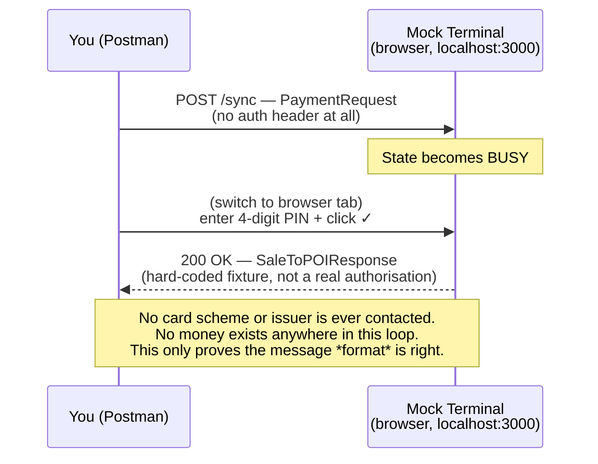
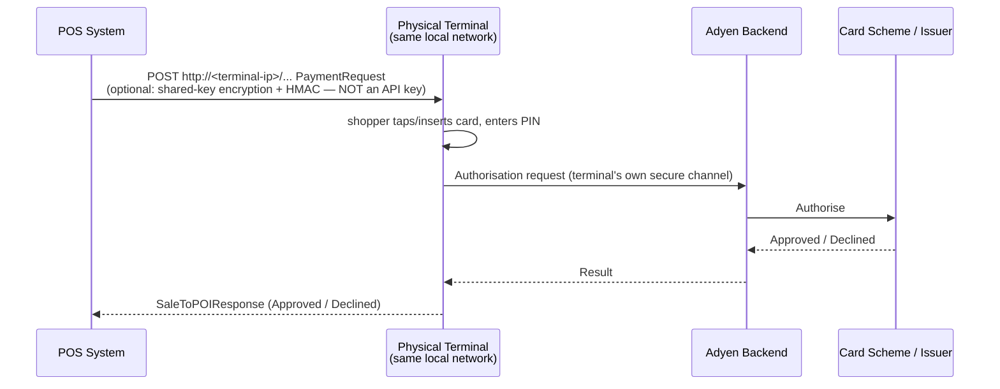
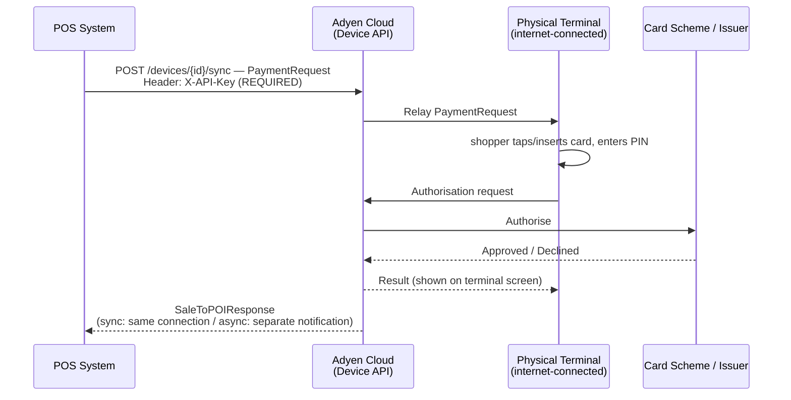
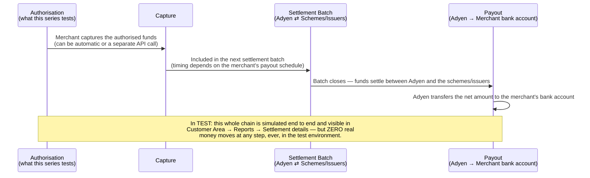

# Adyen POS / Terminal API — Architecture and Background
{: .no_toc }

  

    Table of contents
  

  {: .text-delta }
- TOC
{:toc}

This is the first post in a short series on testing Adyen's **Terminal API** -- the side of Adyen that runs card-present, point-of-sale payments, as opposed to the online checkout flow I covered in [Adyen Online Payments](/tech-adventures/third-party-integrations/adyen-online-payments). Same company, same underlying platform, genuinely different integration shape -- there's a physical (or simulated) terminal in the loop, and "the checkout page" is replaced by a device that talks a completely different message format.

Before touching Postman, I wanted a straight answer to a question that came up almost immediately: *if the terminal talks directly to the POS and hands back a response, can we just treat that response as "payment successful"?* The short answer is no, for two separate reasons, and untangling them is what this whole post is about.

## The core correction

> "Adyen terminals communicate directly with the POS system and return the response — as per our testing, we can assume payment successful?"

Two things need separating here:

1. **Direct terminal↔POS communication is only true for the *local* architecture** (and for the mock server this series tests against, which behaves like a local integration). In the **cloud** architecture, the POS never talks to the terminal directly -- it talks to **Adyen's cloud**, which relays to the terminal and back. Same message format either way, different transport.
2. **"Success" in a Terminal API response only means "authorised."** It does not mean money has moved. Authorisation is the card issuer saying "this cardholder is good for this amount, hold it." Capture, settlement, and payout are separate, later steps.

## What this series actually tests (Track A: mock terminal)

Everything hands-on in this series runs against a community-maintained mock terminal server, standing in for a real device:

No authentication, because there's no Adyen anywhere in this loop -- it's a Postman client talking to a Node.js script on localhost. That's deliberate, and it's the subject of the [next post in this series](/tech-adventures/third-party-integrations/adyen-mock-terminal-local-setup).

## Real life, local integration

This is the architecture the mock stands in for:

{: .note }
In production, "no authentication" isn't quite right either -- Adyen recommends a **shared key** (passphrase-derived encryption + HMAC signing) between POS and terminal, configured in Customer Area at company/merchant/store/terminal level. It's optional but strongly recommended, and it's a different mechanism from an API key: it secures the *local network hop*, not a call to Adyen. ([Protect a local integration](https://docs.adyen.com/point-of-sale/design-your-integration/choose-your-architecture/local/protect))

## Real life, cloud integration

Here the API key authenticates **POS → Adyen**, not POS → terminal. Adyen already has a trusted, provisioned relationship with the terminal (it's boarded to the merchant account), so the terminal itself doesn't need to independently authenticate the POS.

{: .important }
**The hard boundary on testing this without hardware:** without a device actually boarded to a merchant account, Adyen Cloud has nothing to relay to -- every cloud call fails deterministically at the device-lookup step. It's still possible to confirm an `X-API-Key`/`merchantAccount` are valid and see the real error contract Adyen returns, but not to exercise an actual relayed round-trip without something boarded. I hit exactly this wall -- see [the closing post in this series](/tech-adventures/third-party-integrations/adyen-pos-cloud-device-api-limitation).

## Cloud vs. local — the actual tradeoff

| | **Cloud** | **Local** |
|---|---|---|
| **Setup burden** | Low -- Adyen already trusts the boarded terminal; just call a fixed HTTPS endpoint with an API key | Higher -- you manage the local network, terminal IP addressing, and *should* set up shared-key + HMAC encryption yourself (optional, no default protection) |
| **Works offline?** | No -- internet drop = no payments, no fallback | Yes -- supports Offline EMV / store-and-forward; can keep taking payments and reconcile later |
| **Mobile/roaming terminals** | Natural fit -- POS just needs internet, not a shared LAN with the terminal | Poor fit -- POS and terminal must be on the same local network |
| **Latency** | One extra hop (POS→Adyen→Terminal→Adyen→POS) | Direct LAN hop for the POS↔Terminal leg (terminal still needs its own internet connection for the actual authorisation regardless) |
| **Visibility/observability** | Every call logged in Customer Area API logs | The local hop is invisible to Adyen; only the terminal's own authorisation leg shows up in their logs |
| **Where Adyen is investing** | Cloud Device API is the explicit "current/recommended" path | Legacy-adjacent; not going away (offline is unique to it) but isn't where new investment concentrates |

**Rule of thumb:** cloud for anything mobile, portable, or multi-location where you don't want to own network security; local for anything that needs to keep working through flaky or no internet (pop-ups, events, transit) or where a controlled, secured local network already exists.

## Who owns each part of this stack

The `Term->>Adyen: Authorisation request` arrow in the diagrams above is an organizational boundary, not just a technical one:

| Layer | Owned/operated by | Configurable? | Modifiable (bespoke code)? |
|---|---|---|---|
| POS application | You / the merchant's dev team | -- it's yours | Yes, entirely |
| Terminal API message contract | Adyen defines the spec; you implement your side | -- | You implement your side; Adyen's side is fixed |
| Terminal firmware (network stack, EMV kernel, secure channel to Adyen's backend) | Adyen's internal terminal engineering org | **Yes** -- declarative settings only, via Customer Area or the Management API's `terminalSettings` endpoint | **No** -- not by merchants, POS developers, or Adyen's own support engineers |
| Authorisation with card scheme/issuer | Adyen backend | -- | No |

The [`terminalSettings`](https://docs.adyen.com/api-explorer/Management/latest/patch/stores/_storeId_/terminalSettings) endpoint (and its Customer Area UI equivalent) lets you set receipt header/footer, default currency, enabled payment methods, tip prompts, connectivity parameters -- config values the firmware reads and acts on, not logic. Same category as configuring an off-the-shelf appliance's settings menu; there's no path to injecting custom code into what the terminal actually executes.

## Where the money actually moves

This is the part that answers the original question directly: authorisation is not payment completion.

Nothing about capture/settlement/payout is part of the Terminal API request/response loop -- it happens after, driven by Adyen's backend on its own schedule, not by anything the POS calls synchronously. Adyen's own docs are explicit that test cards "do not result in actual credits or debits to a live bank account."

## Summary table — auth requirements, test vs. real life

| Hop | In this series' testing (Track A) | Real life |
|---|---|---|
| POS → Terminal (local) | N/A -- no local hardware | Optional shared-key encryption + HMAC (not an API key) |
| POS → Terminal (cloud) | Blocked -- no boarded device available (Track B) | `X-API-Key` with Cloud Device API role -- mandatory |
| POS → Mock terminal | **No auth at all** | N/A, mock only |
| Terminal → Adyen (authorisation) | Simulated (canned response / amount-suffix trick) | Real authorisation request to the card scheme/issuer |
| Settlement / batch | Simulated, visible in test Customer Area Reports | Real money settles between Adyen and schemes/issuers |
| Payout to merchant | Simulated report only, no bank transfer | Real bank transfer to the merchant's account |

## What's next in this series

With the architecture, ownership boundaries, and money-movement backbone laid out, the next post covers getting a mock terminal running locally and exactly why that's the right starting point before touching anything cloud-side. From there: an approved-payment happy path, two short unhappy-path scenarios (reversal, insufficient balance), and a closing post on exactly where cloud testing hits a hard wall without real hardware.

## Related docs

- [Choose an integration architecture](https://docs.adyen.com/point-of-sale/design-your-integration/choose-your-architecture)
- [Protect a local integration](https://docs.adyen.com/point-of-sale/design-your-integration/choose-your-architecture/local/protect)
- [Settlement reconciliation overview](https://docs.adyen.com/reporting/settlement-reconciliation)

Until next time, peace and love!
