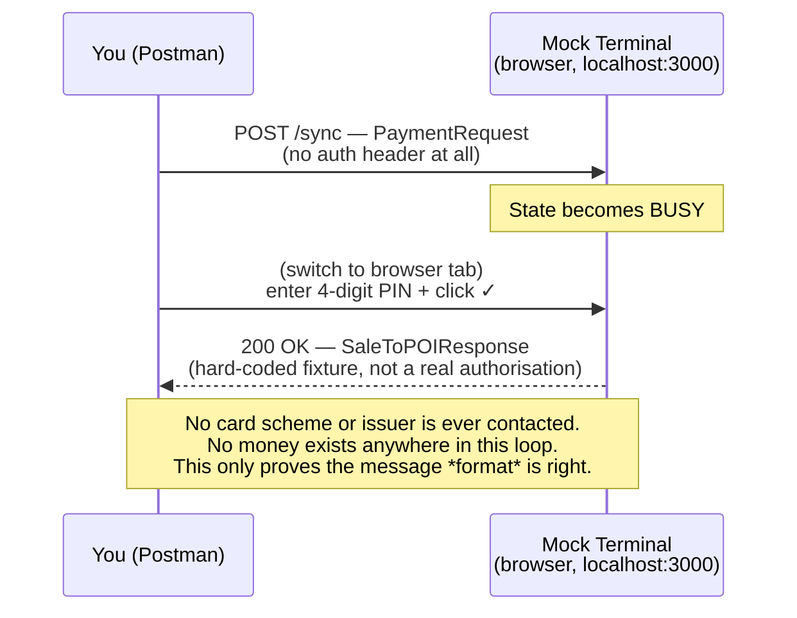

# Approved Sync Payment: A Terminal API Walkthrough
{: .no_toc }

<details closed markdown="block">
  <summary>
    Table of contents
  </summary>
  {: .text-delta }
- TOC
{:toc}
</details>

With the [mock terminal running locally](/tech-adventures/third-party-integrations/adyen-mock-terminal-local-setup), this post walks through the actual happy path: Postman sends a `PaymentRequest`, the mock blocks waiting for simulated PIN entry, entering a PIN in the browser completes it, and Postman receives a `PaymentResponse` with `Result: Success`.

## Context — what this test is actually exercising

This runs **Track A**, which behaves like a *local* Terminal API integration (POS talks straight to "the terminal," no Adyen cloud hop) -- except the terminal is a mock, so nothing past the message format is real. Full detail on both the mock and real-life equivalents is in [the architecture post](/tech-adventures/third-party-integrations/adyen-pos-terminal-api-architecture):



**What's the same as a real local setup:** the exact `SaleToPOIRequest`/`SaleToPOIResponse` JSON shape, the PIN-entry step, the message categories.

**What's different in real life:** the terminal is a real device, optionally protected by a shared-key + HMAC scheme instead of no auth at all; the terminal actually forwards the transaction to Adyen's backend, which authorises against the real card scheme/issuer, instead of returning a hard-coded fixture; "Approved" there still only means *authorised* -- capture/settlement/payout happen later and separately.

## Objective

Confirm the end-to-end message loop works: Postman sends a `PaymentRequest`, the mock blocks waiting for simulated PIN entry, entering a PIN completes it, and Postman receives a response with `Result: Success`.

## Request sent

- Postman request: `Track A - Mock Terminal (no hardware required)` → `Payment - Approved`
- `POST {baseUrlMock}/sync` (`http://localhost:3000/sync`)
- Key parameters: `RequestedAmount: 10.00`, `Currency: EUR`, `SaleID: PostmanPOS-001`, `POIID: MockTerminal-000000001`
- No authentication header of any kind -- the mock doesn't check for one.

## Actual result

`200 OK`, took ~30 seconds (waiting on manual PIN entry in the browser):

```json
{
  "SaleToPOIResponse": {
    "MessageHeader": {
      "ProtocolVersion": "3.0",
      "MessageClass": "Service",
      "MessageCategory": "Payment",
      "MessageType": "Response",
      "ServiceID": "1234567890AB",
      "SaleID": "SALE_ID_42",
      "POIID": "V400m-123456789"
    },
    "PaymentResponse": {
      "POIData": {
        "POITransactionID": {
          "TimeStamp": "2023-06-12T12:08:36+00:00",
          "TransactionID": "v4W5001707426906003.RM4ZVZ7LFTGLNK82"
        }
      },
      "PaymentReceipt": [],
      "PaymentResult": {
        "AmountsResp": { "AuthorizedAmount": 1, "Currency": "EUR" },
        "PaymentAcquirerData": { "MerchantID": "ADYEN_MERCHANT_ACCOUNT", "AcquirerPOIID": "V400m-123456789" },
        "PaymentInstrumentData": { "PaymentInstrumentType": "Card" }
      },
      "Response": { "AdditionalResponse": "...", "Result": "Success" },
      "SaleData": { "SaleTransactionID": { "TimeStamp": "2023-12-02T16:16:48.163Z", "TransactionID": "21f1268f-9126-4bce-b127-9c2d5ffa024e" } }
    }
  }
}
```

{: .note }
This response is a static fixture, not dynamically generated by the mock -- confirmed by reading its source, not inferred. Full proof in the [Appendix](#appendix--proof-that-the-mock-terminals-response-is-static) below.

## Screenshots — step-by-step walkthrough

This is round 2 of the approved-payment test -- a single coherent run (`ServiceID: 24415689`), captured completely.

**Step 1 — Mock terminal open, idle, no transaction in progress**


Request and Response panels both explicitly cleared to `{}` right before sending -- a clean, unambiguous "nothing has happened yet" state.

**Step 2 — POS (Postman) sends the Payment request; it hangs waiting on the terminal**


Postman mid-request: the "Send" button has become "Cancel" and no status/response has landed yet. This is the request sitting in-flight while the mock is `BUSY` waiting for PIN entry.

**Key fields in this request body** (before Postman resolves the template variables):

| Field | Value | Why it matters |
|---|---|---|
| `SaleID` | `PostmanPOS-001` | Identifies the POS system |
| `ServiceID` | fresh per request | Pairs this request to its response, and is what Abort/Reversal/Status reference back to |
| `POIID` | `MockTerminal-000000001` | Identifies the terminal |
| `SaleTransactionID.TransactionID` | POS-side reference | Our own reference for this sale |
| `AmountsReq.Currency` | `EUR` | Currency of the requested amount |

**Step 3 — PIN entered on the mock terminal's keypad**


"Enter your pin..." with four digits already keyed in, just before clicking the green ✓ to confirm. This is the step standing in for "shopper enters PIN" in the real-life local-integration diagram.

**Step 4 — Terminal completes the transaction and prepares the response**


Left/top is the `PaymentRequest` it received (`ServiceID: 24415689`, `SaleID: PostmanPOS-001`), bottom is the `PaymentResponse` (`MessageType: Response`, hard-coded `ServiceID: 1234567890AB`, `SaleID: SALE_ID_42`) it's about to hand back. Note the ServiceID/SaleID mismatch between request and response -- further confirmation of the static-fixture behaviour.

**Step 5 — POS (Postman) receives the response**


`200 OK`, `22.03s`, response body showing `AuthorizedAmount: 1`, `Currency: EUR` -- the same static fixture values regardless of what was requested. In a real POS system, this is the point where the application would parse `Response.Result`, mark the sale as paid, print/display a receipt, and update its own order state.

**Key fields in this response body:**

| Field | Value returned | Why it matters |
|---|---|---|
| `PaymentAcquirerData.MerchantID` | `ADYEN_MERCHANT_ACCOUNT` | Should identify the real merchant account behind the terminal -- here it's a visible placeholder |
| `PaymentAcquirerData.AcquirerPOIID` | `V400m-123456789` | Should identify the acquirer-side terminal -- static in this fixture |
| `SaleTransactionID.TimeStamp` | `2023-12-02T16:16:48.163Z` | Should echo the request's timestamp back -- doesn't |
| `SaleTransactionID.TransactionID` | `21f1268f-9126-4bce-b127-9c2d5ffa024e` | Should echo the request's `TransactionID` back -- doesn't |

Compare against the request table above: these should echo or extend what was sent in a real terminal, but here they're fixed values from the canned fixture -- a quick visual way to spot which fields to trust in this tool's responses.

### Supporting setup screenshots


Postman environment values used (`baseUrlMock`, `poiId`, `saleId`, `currency`, etc.).


Collection variables immediately after the run -- `serviceId`/`transactionId`/`timestamp` populated, but `lastServiceId`/`lastTransactionId`/`lastTimestamp` still blank at this point.


Updated capture, later run: `lastServiceId`/`lastTransactionId`/`lastTimestamp` now correctly populated -- confirms the chaining test script fires and the [Reversal scenario](/tech-adventures/third-party-integrations/adyen-pos-reversal-flow) can rely on it.

## Notes on what this teaches

- No authentication exists in this loop at all -- confirms that Terminal API auth is a *transport* concern (cloud: API key to Adyen; local: optional shared-key encryption to the terminal itself), not something baked into the message schema.
- "Approved" here only means the *message round-trip* succeeded against a canned fixture -- no card scheme or issuer was ever involved, and no money exists anywhere in this test. This validates the *integration shape*, which is exactly what it's meant to do at this stage.

## What's next

This approved payment is the baseline the next two posts build directly on: a [reversal](/tech-adventures/third-party-integrations/adyen-pos-reversal-flow) that references this transaction's identifiers, and a [declined payment](/tech-adventures/third-party-integrations/adyen-pos-insufficient-balance-decline) using the exact same request shape with one digit changed.

---

## Appendix — Proof that the mock terminal's response is static

**1. The fixture file itself** -- `public/payloads/payment/paymentResponse.json`, the literal, complete file on disk:

```json
{
  "SaleToPOIResponse": {
    "MessageHeader": {
      "ProtocolVersion": "3.0",
      "MessageClass": "Service",
      "MessageCategory": "Payment",
      "MessageType": "Response",
      "ServiceID": "1234567890AB",
      "SaleID": "SALE_ID_42",
      "POIID": "V400m-123456789"
    },
    "PaymentResponse": {
      "PaymentResult": {
        "AmountsResp": {
          "AuthorizedAmount": 1.00,
          "Currency": "EUR"
        }
      }
    }
  }
}
```

`AuthorizedAmount: 1.00`, `ServiceID: "1234567890AB"`, `SaleID: "SALE_ID_42"`, `POIID: "V400m-123456789"` are typed into this file by hand -- not templates, not computed, not populated from any request.

**2. Loaded once at server startup, cached, never re-read per request:**

```js
// getRequestsAndResponses(rootPath) — runs once at startup
responseJson: JSON.parse(fs.readFileSync(path.join(filePath, responseFile), encoding))
...
map[pair.prefix] = [pair.requestJson, pair.responseJson]
```

```js
// getResponseByPrefix(prefix) — called on every request
getResponseByPrefix(prefix) {
    return this.data[prefix][1];   // <- same object, every single time
}
```

No per-request parsing, no field substitution, no templating engine anywhere in this path.

**3. The routing that decides which fixture to hand back:**

```js
if (paymentService.containsPrefix(req)) {
    const paymentResponse = await paymentService.getResponse(req);
    sendOKResponse(res, paymentResponse);   // paymentResponse is just a *string key*, e.g. "payment"
    return;
}
```

The only place the request body is inspected computes the last 3 digits of the amount to pick a **key name**:

```js
const amount = request.body.SaleToPOIRequest.PaymentRequest.PaymentTransaction.AmountsReq.RequestedAmount;
const lastThreeDigits = amount.toString().replace('.', '').padStart(3, '0').slice(-3);
const paymentFailure = paymentFailureMap[lastThreeDigits];

if (paymentFailure) {
    return paymentFailure;   // e.g. "124_paymentNotEnoughBalance"
}
return "payment";            // <- our €10.00 request lands here: the generic "approved" key
```

That returned string (`"payment"`) is handed to `getResponseByPrefix("payment")`, which returns the exact cached object from step 1 -- untouched.

**Conclusion:** fully expected, by-design behaviour of this specific community mock tool, confirmed by reading all three layers of its source rather than guessing from the response alone. The mock's job is only to prove the *message shape* is right -- it was never built to echo amounts or generate dynamic IDs.

Until next time, peace and love!
