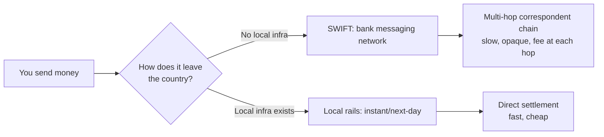
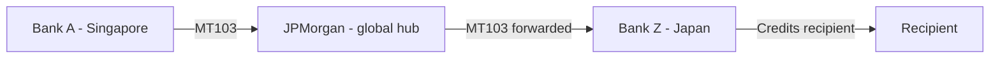

# Cross-Border Payments 101: Reading the Docs Before Writing a Line of Code
{: .no_toc }

<details closed markdown="block">
  <summary>
    Table of contents
  </summary>
  {: .text-delta }
- TOC
{:toc}
</details>

I recently spent a chunk of my free time doing something a bit unusual for fun: I went deep on **Wise Platform**, the B2B API that lets banks and fintechs (think Monzo, N26, Google Pay) embed international money transfers into their own apps. Not as a user -- as an engineer. I read the docs, poked at the sandbox, and ran real transfers through Postman to see how the theory held up against the actual API.

This is the first post in a short series documenting that deep-dive. Before touching a single API endpoint, I wanted to actually understand the domain -- because "call the quote endpoint, then the transfer endpoint" means nothing if you don't know *why* a quote expires, *why* a transfer can sit for days, or *why* a bank gives you a worse exchange rate than the one on Google. This post is that groundwork. The next posts get hands-on with Postman, real JSON payloads, and a few sandbox behaviors that didn't match the documentation at all.

## Why cross-border payments are hard in the first place

If you've ever sent money abroad through a traditional bank, you've probably experienced some version of: it takes days, the fee is unclear, and the exchange rate you got wasn't quite what you expected. None of that is incompetence -- it's a direct consequence of how the underlying infrastructure works.



## Part 1 -- SWIFT: the network that moves instructions, not money

The single most important thing to understand about SWIFT (Society for Worldwide Interbank Financial Telecommunication) is this:

{: .important }
> SWIFT does not move money. It sends standardised messages between banks telling them what to do with money they *already hold* for each other.

Banks that do business together hold accounts at each other -- a **nostro account** ("our account at your bank") and its mirror, a **vostro account** ("your account at our bank"). These are pre-funded. When a bank wants to send money abroad, the money is already sitting at the destination bank; SWIFT just carries the instruction to release it.

### What a SWIFT message actually looks like

When a bank sends a customer's payment abroad, it issues an **MT103** (Message Type 103: Single Customer Credit Transfer). Every field is tagged so any SWIFT-connected bank in the world can parse it identically:

```
:20:REF-2026-001234         ← Unique transaction reference
:23B:CRED                   ← Operation code: CRED = credit the beneficiary
:32A:260626GBP1000,00       ← Value date, currency, amount
:50K:/12345678              ← Ordering party (sender): account number
      JOHN SMITH
      10 BAKER STREET
      LONDON GB
:57A:DBSASGSG               ← Beneficiary's bank BIC/SWIFT code
:59:/12345678901            ← Beneficiary: account number
    AHMAD SHAFIK
    SINGAPORE
:70:INVOICE 2026-JUN        ← Payment reference
:71A:SHA                    ← Who pays fees: SHA = each party pays their own bank
```

### Why a payment can take several hops

If the sending bank has no direct relationship with the destination bank, the message routes through one or more **correspondent banks** -- large global players like JPMorgan, Citibank, or HSBC that hold relationships with thousands of banks worldwide.



Every hop adds time (each bank has its own daily processing cut-off), cost (a correspondent fee), and compliance risk (each bank independently screens the payment -- a flag anywhere in the chain pauses the whole transfer). This is also why cross-border payments effectively run **24/5, not 24/7** -- most of the infrastructure banks rely on doesn't operate on weekends.

## Part 2 -- Local rails: the alternative Wise is built on

Wise's core structural insight is that most cross-border flows are two-way. If a thousand people send GBP→EUR on a given day and a thousand others send EUR→GBP, those flows largely cancel out -- a process called **netting**. Instead of wiring money across a border for every transaction, Wise holds pre-funded local currency accounts in 40+ countries and pays out of the local pool.

```
Traditional (SWIFT):
You (UK) --GBP--> HSBC --[correspondent chain]--> Recipient bank (EU) --EUR--> Recipient
          ↑ slow, expensive, opaque ↑

Wise (local rails):
You --GBP--> Wise UK account      Wise EU account --EUR--> Recipient
    [Faster Payments, instant]     [SEPA, next day]
    ↑ No cross-border movement. Two local transfers. ↑
```

This matters a lot for the APAC corridor specifically, since APAC has no unified account standard the way Europe has IBAN:

| Country | Rail | Speed | Account format quirk |
|---|---|---|---|
| Singapore | FAST / PayNow | Near-instant / instant | PayNow uses phone/NRIC/UEN -- no account number |
| Australia | NPP / Osko | Near-instant | Requires BSB code (`XXX-XXX`) -- easy to omit if your system was built for IBAN |
| Hong Kong | FPS | Near-instant | Bank code + account number |
| Japan | Zengin | Same-day (if before cut-off) | Bank code + branch code + account type |
| India | UPI / IMPS | Instant | IFSC code (11 chars) |

{: .note }
Get an APAC account format wrong and the failure mode differs by stage: a bad field caught by API validation is an immediate 400/422 (cheap to fix); a bad field that *passes* validation but fails at the recipient bank means the transfer bounces after 1-7 days, and funds have to return to the sender before a retry.

## Part 3 -- FX: what "mid-market rate" actually means

Foreign exchange is a ~$7 trillion-a-day market with no central exchange. At any moment, market makers quote two prices for a currency pair: a **bid** (what they'll pay you for it) and an **ask** (what they'll charge you for it). The gap between them is the **spread** -- how the market maker earns money.

```
EUR/GBP rate:   Bid 0.8500  |  Ask 0.8510
Mid-market rate = (Bid + Ask) / 2 = 0.8505
```

The **mid-market rate** is the reference point everyone quotes (Google, XE, Reuters) -- but almost nobody transacts at exactly that rate. This is the mechanism traditional banks exploit:

```
Mid-market rate today:  1 SGD = 0.7500 USD
Bank gives you:         1 SGD = 0.7200 USD   ← 4% markup hidden in the rate
On S$10,000:            you lose ~S$400 compared to mid-market, with "no fee" charged
```

Wise's entire pitch is the inverse of this: give the mid-market rate with no markup, and charge a small transparent fee instead. Whether the fee actually stays that transparent in practice at execution time is something I'll come back to later in this series -- it turned out to be one of the more interesting findings from testing.

## Part 4 -- The quote-to-transfer API shape

With the fundamentals out of the way, here's the shape of the actual API flow that Wise Platform partners integrate against. A partner first requests a quote:

```http
POST /v3/profiles/{profileId}/quotes
Content-Type: application/json

{
  "sourceCurrency": "SGD",
  "targetCurrency": "GBP",
  "sourceAmount": 10000,
  "payOut": "BANK_TRANSFER"
}
```

```json
{
  "id": "quote-uuid-here",
  "rate": 0.5720,
  "sourceCurrency": "SGD",
  "targetCurrency": "GBP",
  "sourceAmount": 10000,
  "targetAmount": 5720,
  "fee": 45.00,
  "expirationTime": "2026-06-26T10:30:00Z",
  "paymentOptions": [...]
}
```

The rate is locked at the moment of quote creation and is guaranteed until `expirationTime`. The partner then creates the actual transfer against that quote:

```http
POST /v1/transfers
{
  "targetAccount": 123456,
  "quoteUuid": "quote-uuid-here",
  "customerTransactionId": "partner-ref-001"
}
```

{: .note }
Quotes are free to generate as many times as needed -- Wise only charges on executed transfers. Partners routinely shop rates before committing, and treasury teams compare Wise against alternatives like Airwallex and Nium before choosing a corridor.

Underneath, converting currency inside Wise's system is mostly a **database entry, not a live bank movement** -- Wise's treasury team nets opposing flows and only moves real money across its own bank accounts when the net position requires it. That's part of why Wise can process a conversion instantly even though "the money" hasn't physically gone anywhere yet.

## Part 5 -- Compliance is not optional, and it's often invisible to you

Every transfer is screened against sanctions lists (OFAC, UN, EU, MAS in Singapore) before it's processed, using fuzzy matching that catches spelling variations and transliterations. Beyond that baseline, transaction monitoring watches for patterns like structuring (breaking a transfer into pieces to dodge a reporting threshold) or a dormant account suddenly receiving and immediately forwarding a large sum.

{: .warning }
If a transfer is on compliance hold, there's a hard legal line around what can be communicated. "Tipping off" a customer that their transaction is under investigation for money laundering is a criminal offence in most jurisdictions (Singapore's CDSA, UK's POCA). The correct posture is always some version of: *"This transfer is under review. I can't share details. Typical resolution is 1-5 business days."* Nothing more.

This matters directly for API testing too, as it turns out -- in the next post, one of the sandbox simulation calls gets blocked specifically because the test profile isn't KYC-verified, and the error message reflects exactly this kind of compliance gate.

## What's next in this series

With the domain model in place -- SWIFT vs. local rails, mid-market FX, the quote/transfer API shape, and where compliance sits in the flow -- the next post gets hands-on: a full Postman walkthrough of an actual SGD→GBP transfer through Wise's sandbox, with real request/response payloads, real IDs, and real screenshots from the run. After that, a post specifically about where the sandbox's *actual* behavior diverged from what the documentation says -- including one API error that isn't documented anywhere.

Until next time, peace and love!
