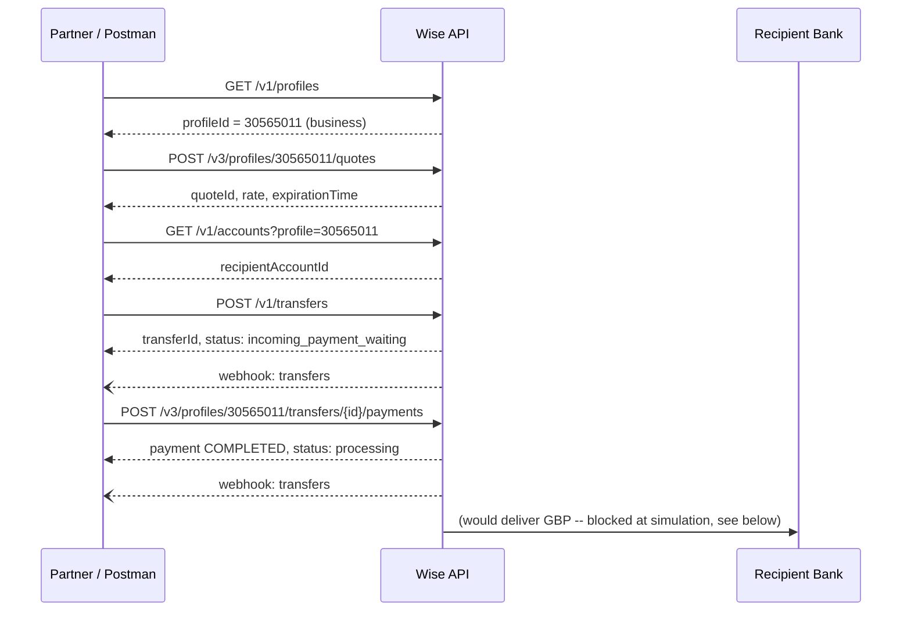



# From Postman to Production Flow: Testing a Cross-Border Transfer End-to-End
{: .no_toc }

<details closed markdown="block">
  <summary>
    Table of contents
  </summary>
  {: .text-delta }
- TOC
{:toc}
</details>

In the [previous post](/tech-adventures/third-party-integrations/cross-border-payments-101) I covered the theory behind cross-border payments: SWIFT, local rails, FX rates, and where compliance sits in the flow. This post is where I actually put that understanding to work. I built a Postman collection against Wise Platform's sandbox and ran a real SGD → GBP transfer end to end, capturing every request, response, and webhook along the way.

This isn't a "here's what the docs say happens" post. Every ID, rate, and screenshot below came from an actual run.

**Environment**: Wise Sandbox V1 (`https://api.sandbox.transferwise.tech`)
**Flow**: SGD → GBP, `BALANCE` payIn, `BANK_TRANSFER` payOut
**Tool**: Postman, custom-built collection with post-response scripts auto-capturing IDs into collection variables

## The flow, at a glance



Every step produces an ID the next step consumes. Here's each one, with the actual response captured.

## Collection Variables


| Variable | Value | Set by |
|---|---|---|
| `baseUrl` | `https://api.sandbox.transferwise.tech` | Manual |
| `profileId` | `30565011` | Step 1 |
| `quoteId` | `edde2022-7404-47e5-ac8e-237860b37a29` | Step 2 |
| `recipientAccountId` | `702492988` | Step 3 |
| `transferId` | `2147687447` | Step 4 |
| `apiToken` | (masked) | Manual |

## Step 1: Get Profiles

`GET /v1/profiles/`


**200 OK** (312ms). A post-response script selects the `type: "business"` profile and sets `{{profileId}} = 30565011`.

## Step 2: Create Quote (SGD → GBP)

`POST /v3/profiles/{{profileId}}/quotes`

```json
{
  "sourceCurrency": "SGD",
  "targetCurrency": "GBP",
  "sourceAmount": 200,
  "payOut": "BANK_TRANSFER"
}
```


**200 OK** (769ms)

| Field | Value | Notes |
|---|---|---|
| `id` | `edde2022-7404-47e5-ac8e-237860b37a29` | Set as `{{quoteId}}` |
| `rate` | `0.582737` | Locked SGD/GBP rate |
| `expirationTime` | `2026-07-01T07:03:48Z` | 30-minute window to create the transfer |
| `status` | `PENDING` | Quote is live |

## Step 3: Retrieve Recipient Account

`GET /v1/accounts?profile={{profileId}}`


**200 OK** (285ms) -- an existing GBP recipient is retrieved and reused.

| Field | Value |
|---|---|
| `id` | `702492988` |
| `accountHolderName` | `Test Recipient Three` |
| `currency` | `GBP` |

## Step 4: Create Transfer

`POST /v1/transfers`

```json
{
  "targetAccount": {{recipientAccountId}},
  "quoteUuid": "{{quoteId}}",
  "customerTransactionId": "{{$guid}}",
  "details": {
    "reference": "TestTransfer"
  }
}
```


**200 OK** (1.64s)

| Field | Value | Notes |
|---|---|---|
| `id` | `2147687447` | Set as `{{transferId}}` |
| `status` | `incoming_payment_waiting` | Expected initial state |
| `customerTransactionId` | `25e53d57-6325-4415-9867-554eb24729d4` | Auto-generated GUID |

{: .note }
`customerTransactionId` is an idempotency key. If the create-transfer request fails mid-flight (dropped connection, timeout), retrying with the exact same `customerTransactionId` and payload returns the original transfer rather than creating a duplicate. I verified this behavior directly in [the next post](/tech-adventures/third-party-integrations/sandbox-vs-docs-reconciliation).

### Webhook: `incoming_payment_waiting`

Transfer creation triggers an immediate `transfers#state-change` webhook to the registered callback endpoint (webhook.site, used as a public HTTPS receiver for sandbox testing).


```json
{
  "data": {
    "resource": {
      "id": 2147687447,
      "profile_id": 30565811,
      "account_id": 702492988,
      "type": "transfer"
    },
    "current_state": "incoming_payment_waiting",
    "previous_state": null,
    "occurred_at": "2026-07-01T06:43:31Z"
  },
  "event_type": "transfers#state-change",
  "schema_version": "2.0.0",
  "sent_at": "2026-07-01T06:43:32Z"
}
```

All four `resource` fields are present here (`id`, `profile_id`, `account_id`, `type`), and `sent_at` is a sensible one second after `occurred_at`. I'm calling this out specifically because in a separate exercise analyzing a deliberately-broken sample payload, both of those things were wrong -- `profile_id`/`account_id` were missing and `sent_at` preceded `occurred_at` by 10 days. Seeing a clean, correctly-ordered webhook here gave me something real to contrast that broken sample against.

## Step 5: Fund Transfer from Balance

`POST /v3/profiles/{{profileId}}/transfers/{{transferId}}/payments`

```json
{
  "type": "BALANCE"
}
```


**201 Created** (1.16s). Before this call, the SGD balance was topped up via `POST /v1/simulation/balance/topup` -- a sandbox-only endpoint with no production equivalent.

| Field | Value |
|---|---|
| `type` | `BALANCE` |
| `status` | `COMPLETED` |
| `balanceTransactionId` | `8886936` |

## Step 5b: Get Transfer Status

`GET /v1/transfers/{{transferId}}`


**200 OK** (325ms)

| Field | Value |
|---|---|
| `status` | `processing` |
| `sourceValue` | `191.83` SGD |
| `targetValue` | `111.79` GBP |

### Webhook: `processing`

The `incoming_payment_waiting → processing` transition fires a second webhook automatically -- no polling required on the partner side.


```json
{
  "data": {
    "resource": {
      "id": 2147687447,
      "profile_id": 30565811,
      "account_id": 702492988,
      "type": "transfer"
    },
    "current_state": "processing",
    "previous_state": "incoming_payment_waiting",
    "occurred_at": "2026-07-01T06:45:45Z"
  },
  "event_type": "transfers#state-change",
  "schema_version": "2.0.0",
  "sent_at": "2026-07-01T06:45:45Z"
}
```

## Step 6: Cross-checking against the Wise console UI

With the transfer in `processing`, I pulled up the same transaction in the Wise sandbox console to confirm every API value matched what a real user would see.


| UI field | Value shown | API source | Match |
|---|---|---|---|
| Transaction number | #2147687447 | `POST /v1/transfers` → `id` | ✓ |
| Recipient name | Test Recipient Three | `GET /v1/accounts` → `accountHolderName` | ✓ |
| Amount sending | 200 SGD | Quote `sourceAmount` | ✓ |
| Wise's fees | 8.17 SGD | Quote `paymentOptions[].fee.total` | ⚠️ see below |
| Amount we'll convert | 191.83 SGD | `GET /v1/transfers` → `sourceValue` | ✓ |
| Recipient receives | 111.79 GBP | `GET /v1/transfers` → `targetValue` | ✓ |
| Exchange rate | 1 SGD = 0.5827 GBP | Quote `rate` (0.582737), UI rounds to 4dp | ✓ |

Everything lines up cleanly -- except the fee row. The quote's `paymentOptions[BALANCE].fee.total` actually said **1.29 SGD**, not 8.17 SGD. I flagged this row rather than quietly matching it, because it turned into the single most interesting finding of the whole exercise -- reproduced three separate times, on two sandbox versions, on both business and personal profiles. The full investigation is in the [next post](/tech-adventures/third-party-integrations/sandbox-vs-docs-reconciliation).

## Step 7: Trying to push the transfer to a terminal state

The UI showed the transfer as **Pending**. To see whether it could reach a terminal state, I used Wise's sandbox-only simulation endpoints to try to force the next transitions.

### Step 7a: Simulate `funds_converted`

`GET /v1/simulation/transfers/{{transferId}}/funds_converted`


**400 Bad Request**

```json
{
  "errors": [
    {
      "code": "wrong_status",
      "message": "Transfer processing is suspended due to one or more payment processing issues. please ensure profile is verified and consult the relevant regional guide in the API documentation."
    }
  ]
}
```

This is a real, functioning compliance gate showing up in a sandbox environment: the business profile used for this run wasn't KYC-verified, and Wise's simulation API enforces the same verification requirement sandbox-side that it would in production.

### Step 7b: Simulate `outgoing_payment_sent`

`GET /v1/simulation/transfers/{{transferId}}/outgoing_payment_sent`


**400 Bad Request**

```json
{
  "errors": [
    {
      "code": "wrong_status",
      "message": "Transfer needs to be in state 'funds_converted' before this action. You cannot change transfer from state 'PROCESSING' to state 'funds_converted'."
    }
  ]
}
```

{: .warning }
The simulation state machine enforces strict sequencing -- you cannot skip `funds_converted` on the way to `outgoing_payment_sent`, even in a test environment. Combined with the KYC block above, reaching a fully `completed` transfer in sandbox requires two separate conditions to both be satisfied: a verified profile, *and* calling every intermediate state in order. Miss either one and the simulation call fails with `wrong_status` -- the same error code for two structurally different reasons.

## Summary

| Step | API Call | Result |
|---|---|---|
| 1 | `GET /v1/profiles` | Business profile `30565011` captured |
| 2 | `POST /v3/profiles/{id}/quotes` | SGD→GBP quote created, rate `0.582737` locked |
| 3 | `GET /v1/accounts?profile={id}` | Existing GBP recipient `702492988` retrieved |
| 4 | `POST /v1/transfers` | Transfer `2147687447` created, `incoming_payment_waiting` |
| — | webhook | `null` → `incoming_payment_waiting` received |
| 5 | `POST /v3/profiles/{id}/transfers/{id}/payments` | Funded via BALANCE, `COMPLETED` |
| 5b | `GET /v1/transfers/{id}` | Status confirmed: `processing` |
| — | webhook | `incoming_payment_waiting` → `processing` received |
| 6 | Wise sandbox console | All API values confirmed in UI, except fee (flagged) |
| 7a | Simulate `funds_converted` | 400 -- profile not KYC-verified |
| 7b | Simulate `outgoing_payment_sent` | 400 -- `wrong_status`, sequence violated |

The transfer never reached a terminal state in this run -- and that's exactly what made it interesting. Getting blocked by a real KYC gate and a real state-machine constraint, inside a sandbox, told me more about how the system actually behaves under the hood than a clean happy-path run would have. The fee mismatch flagged in Step 6 turned into a genuine investigation, which is where the next post picks up.

Until next time, peace and love!


