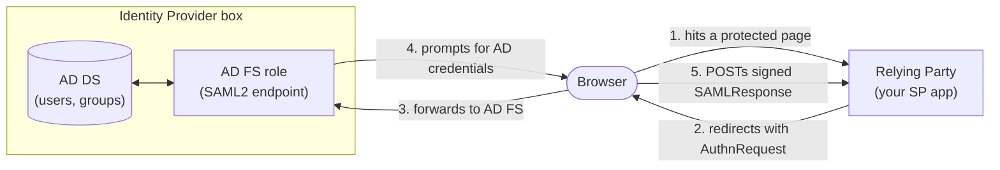

# Setting Up an ADFS Server for SAML Testing
{: .no_toc }

  

    Table of contents
  

  {: .text-delta }
- TOC
{:toc}

If you're building a Service Provider (SP) that needs to authenticate against a customer's or partner's Active Directory Federation Services (AD FS) instance, the fastest way to get confident in your integration is to stand up your own throwaway AD FS server and point your SP at that first. You get a fully working SAML2 identity provider you control, with no dependency on someone else's environment being configured correctly (or configured at all) before you can start testing.

Everything in this post is from a real lab: a single EC2 instance running both AD DS and AD FS, built specifically to learn the moving parts before integrating against a real customer environment. Every screenshot below is from that actual box.

## Where AD FS sits

AD FS is Microsoft's SAML2 (and WS-Federation) identity provider. It doesn't store users itself -- it sits in front of Active Directory Domain Services (AD DS) and turns a successful Windows/AD login into a signed SAML assertion that a relying application (the SP) can trust.

Three pieces have to exist before anything works:
1. **AD DS** -- a domain, with at least one user to log in as.
2. **AD FS role**, installed on a domain-joined server, with a federation service name and a token-signing certificate.
3. A **Relying Party Trust** on the AD FS side, representing your SP (or, while you're still learning the tool, Microsoft's own debugging relying party -- more on that below) -- this is what tells AD FS "this application is allowed to receive assertions, and here's where to send them."

## 1. Stand up AD DS and add a test user

The lab domain controller was set up by following [this step-by-step domain controller guide](https://social.technet.microsoft.com/wiki/contents/articles/12370.windows-server-2012-set-up-your-first-domain-controller-step-by-step.aspx) -- promoting a Windows Server VM to a domain controller. The domain used here is `walakakaiscool.com`.

With the domain up, a test user gets added via **Server Manager → Tools → Active Directory Users and Computers**:

The AD user's **Display Name** field (here, `shafik sw. walakaka`) matters later -- it's what shows up as the claim value once AD FS passes it through to a relying party.

{: .note }
Give the test user a password you're comfortable having live in a lab environment -- it'll be typed into a sign-in form on screen in a later step, so treat it as disposable, not as a real secret.

## 2. Install the AD FS role

The AD FS role was installed on the same box following [this AD FS install guide](https://cloudinfrastructureservices.co.uk/how-to-install-adfs-on-windows-server-2022/) -- add the **Active Directory Federation Services** role via Server Manager, then run the post-deployment configuration wizard (token-signing certificate, federation service name). Once it's up, the federation metadata endpoint (`https://<your-adfs-host>/FederationMetadata/2007-06/FederationMetadata.xml`) should return XML -- that's the signal AD FS plumbing itself is healthy, independent of anything relying-party-specific that comes next.

## 3. Add a custom claim

To understand how AD attributes get mapped into SAML claims (rather than just using the defaults), the lab adds a **custom claim description** in the AD FS management console (**AD FS → Service → Claim Descriptions → Add Claim Description**) -- here, one called `Crazy Department`:

This is deliberately not a claim you'd ship for real -- the point is to prove out the AD-attribute → claim-type mapping mechanism with something obviously custom, before trusting it with real attribute names.

## 4. Register a relying party -- the easy way, with Claims X-Ray

Rather than hand-registering a throwaway relying party trust, this lab uses Microsoft's official `ClaimsXrayManager.ps1` script, which sets up AD FS's built-in debugging relying party for you (documented in Microsoft's [Claims X-Ray guide](https://learn.microsoft.com/en-us/windows-server/identity/ad-fs/operations/ad-fs-claims-x-ray), and covered more generally in [Microsoft's guide to creating a relying party trust](https://learn.microsoft.com/en-us/windows-server/identity/ad-fs/operations/create-a-relying-party-trust)). Running it against the AD FS server creates a relying party trust named `ClaimsXray`:

...with a default **Issue all claims** rule already applied -- every attribute AD FS is configured to know about gets passed straight through:

This is the single most useful default while you're still validating the pipe works at all: it means you don't have to guess which specific claim to look for -- everything shows up, and you can narrow it down later.

## 5. Map the custom claim to an AD attribute

With the default rule in place, add a second claim rule mapping an LDAP attribute to the custom claim from step 3 -- here, `Display-Name` → `Crazy Department`:

This is the concrete answer to "how do AD attributes become SAML claims": a claim rule is just a named mapping from an attribute store (Active Directory) field to an outgoing claim type. Real customer AD FS environments do the same thing with real attribute names (`mail`, `department`, `employeeID`, etc.) -- this is the exact same mechanism, just with an obviously-fake claim name so it's unambiguous in screenshots which value came from where.

## 6. Test the whole pipeline with Claims X-Ray

With a relying party and claim rules in place, Microsoft's hosted **Claims X-Ray** tool (`https://adfshelp.microsoft.com/ClaimsXray/TokenRequest`) drives an actual sign-in against the lab AD FS server and shows you exactly what comes back -- without needing any SP code at all yet.

**a. Enter the AD FS server's federation service name:**

**b. Click Test Authentication:**

**c. Sign in with the AD test user** -- note the `DOMAIN\username` format:

**d. AD FS identifies which relying party to redirect back to** via an identifier baked into the login URL itself:

**e. Claims X-Ray renders the raw SAML response.** The custom claim from step 5 shows up with the AD user's actual Display Name as its value:

Compare against the AD user's properties dialog -- the value matches exactly, because it's the same `Display-Name` attribute the claim rule in step 5 pulled from:

**f. The response is signed** -- Claims X-Ray shows both the signature and the certificate needed to verify it, which is exactly what a real SP has to validate:

This whole loop -- register a relying party, add claim rules, sign in, inspect the returned claims -- is the same loop you'd run for a real SP, just with Microsoft's tool standing in for your own application. Once the claims coming out of this look right, you're ready to register your *actual* SP as its own relying party trust, which the walkthrough later in this series covers from the SP's side.

## Registering your own SP as a relying party trust

The same **Add Relying Party Trust** wizard used for Claims X-Ray works for your own SP. AD FS gives you two ways to describe it:

- **Import a metadata URL** -- you give AD FS your SP's own metadata endpoint (e.g. `https://localhost:7196/Saml2`), and AD FS pulls the entity ID, ACS endpoint, and certs from it directly.
- **Import a static metadata file / manually enter data** -- useful if your SP isn't reachable from the AD FS server (e.g. it's still on localhost and AD FS is a remote VM), but means any change to your SP's config requires re-importing.

Prefer the metadata URL approach if at all possible: when your SP's entity ID, ACS URL, or signing cert changes later (and across dev → test → prod it usually does), you re-point the RP trust at the new URL instead of re-doing the whole registration. AD FS trusts can be updated to a new metadata URL after creation without deleting and recreating them.

{: .important }
The single most important field here is the **Relying Party Identifier** -- this must exactly match the `EntityId` your SP presents (scheme included: `https://` vs `http://` is a real mismatch, not just cosmetic).

## Do you need to sign AuthnRequests?

A question that comes up early and is worth settling before you write any SP code: does the *SP* need to sign the outgoing AuthnRequest?

**No, not by default.** The direction of trust that matters for a standard SAML2 SP-initiated flow is: AD FS signs its *responses* (as seen in step 6f above), and your SP validates that signature using the certificate AD FS publishes in its federation metadata. Your SP doesn't need its own signing certificate unless you also want to sign logout requests or you're in a setup that specifically requires signed AuthnRequests (some IdPs enforce this as a config option -- AD FS doesn't by default).

## What's next in this series

With an AD FS server up, a custom claim mapped, and Claims X-Ray confirming the whole pipeline works, the next post checks AD FS's health independently -- the federation metadata endpoint, the two certificates that get confused for each other, and how to repoint a relying party trust without rebuilding it. After that, a real ASP.NET Core SAML2 SP gets pointed at this same lab, and the full browser redirect flow gets walked through screenshot by screenshot.

Until next time, peace and love!
