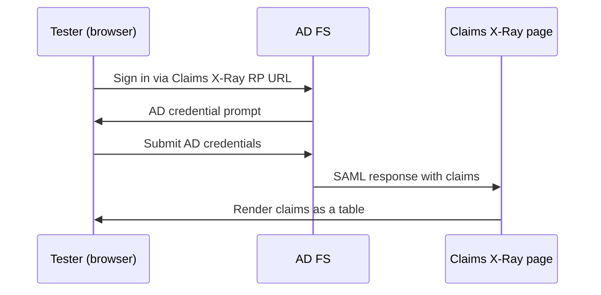

# Verifying and Troubleshooting the ADFS Side
{: .no_toc }

<details closed markdown="block">
  <summary>
    Table of contents
  </summary>
  {: .text-delta }
- TOC
{:toc}
</details>

The [previous post](/tech-adventures/third-party-integrations/adfs-setting-up-server) covered getting an AD FS server running and a relying party trust registered. Before pointing a real SP at it, it's worth independently confirming AD FS itself is healthy and issuing the claims you expect -- that way, if the end-to-end flow fails later, you already know whether the problem is on the IdP side or the SP side.

## Step 1: confirm the federation metadata endpoint

Every AD FS instance publishes its configuration as XML at a fixed path:

```bash
curl -s https://adfs-lab.local/FederationMetadata/2007-06/FederationMetadata.xml
```

A healthy response is a well-formed `<EntityDescriptor>` document containing an `<IDPSSODescriptor>`. Two things worth checking inside it, since they're what your SP will actually consume:

```xml
<EntityDescriptor entityID="http://adfs-lab.local/adfs/services/trust">
  <IDPSSODescriptor protocolSupportEnumeration="urn:oasis:names:tc:SAML:2.0:protocol">
    <KeyDescriptor use="signing">
      <ds:KeyInfo>
        <ds:X509Data>
          <ds:X509Certificate>MIIC3DCCAcSg...</ds:X509Certificate>
        </ds:X509Data>
      </ds:KeyInfo>
    </KeyDescriptor>
    <SingleSignOnService
      Binding="urn:oasis:names:tc:SAML:2.0:bindings:HTTP-Redirect"
      Location="https://adfs-lab.local/adfs/ls/" />
  </IDPSSODescriptor>
</EntityDescriptor>
```

- `entityID` -- this is the IdP's identifier. Your SP's config needs to reference this exact value (not the federation service *hostname*, which is often a different string -- e.g. an `http://` trust URN vs an `https://` login endpoint).
- `X509Certificate` under `use="signing"` -- this is the certificate your SP will use to validate the signature on every SAML response it receives. If your SP is pulling metadata live via `LoadMetadata = true` (as opposed to a pinned static cert), this updates automatically whenever AD FS rotates its signing cert -- which is also exactly the failure mode to check for if signature validation suddenly starts failing after having worked before, covered later in this series.

{: .warning }
If this endpoint doesn't resolve or times out, stop here -- nothing downstream will work, and it's a network/DNS problem rather than a SAML configuration problem.

## Step 2: use Claims X-Ray to verify claims independently

With Claims X-Ray registered in the [previous post](/tech-adventures/third-party-integrations/adfs-setting-up-server), sign in through the URL it exposes and confirm the claims table matches what you expect *before* testing against your real SP. This isolates two otherwise-tangled questions:



- **"Is AD FS configured to send what I need?"** -- answered here, independent of any SP.
- **"Is my SP correctly parsing what it receives?"** -- deferred to the next post, once you already trust the IdP side is correct.

{: .note }
If a claim you expect (say, `department` or `mail`) is missing from the Claims X-Ray table, that's a claim-rule problem on the AD FS side -- fix it there before touching any SP code, since the SP can't produce a claim the IdP never sent.

## Two different certificates, two different trust problems

A recurring source of confusion: an AD FS integration involves **two unrelated certificates**, and "certificate error" reports need to specify which one:

| Certificate | Purpose | Where it's trusted |
|---|---|---|
| AD FS's **TLS/SSL certificate** | Secures the HTTPS connection to the AD FS server itself | The OS/browser's trusted root store on whatever machine is calling AD FS |
| AD FS's **token-signing certificate** | Signs the SAML assertion payload | Your SP's SAML library config (often auto-updated via `LoadMetadata`) |

If your SP can't even load the AD FS login page over HTTPS, that's the TLS certificate -- usually because AD FS is using a self-signed or internal-CA cert that isn't in your test machine's trusted root store yet. Installing that cert into **Trusted Root Certification Authorities** on the machine running the SP (or the machine's browser, for a manual test) resolves it.

If the SP *reaches* AD FS fine, gets redirected back with a `SAMLResponse`, but then rejects it as an invalid signature, that's the token-signing certificate -- usually because the SP has a stale/pinned copy of an old signing cert instead of pulling current metadata live.

## Confirming an RP trust can be repointed later

One more thing worth verifying while you're still in the AD FS management console: that an existing Relying Party Trust's metadata URL can be updated in place, without deleting and recreating the trust. This matters because your SP's own URL will almost certainly change across environments (local dev → test → prod), and re-doing RP trust setup from scratch every time is unnecessary friction. In the AD FS console, this is just editing the trust's properties and pointing the metadata URL field at the new location -- no need to touch claim rules again.

## What's next in this series

With AD FS confirmed healthy on its own terms -- metadata reachable, claims correct, certificates sorted into the right buckets -- the next post points a real ASP.NET Core SP at this same lab and walks through every step of the browser redirect flow with screenshots.

Until next time, peace and love!
