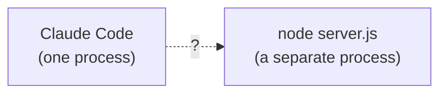
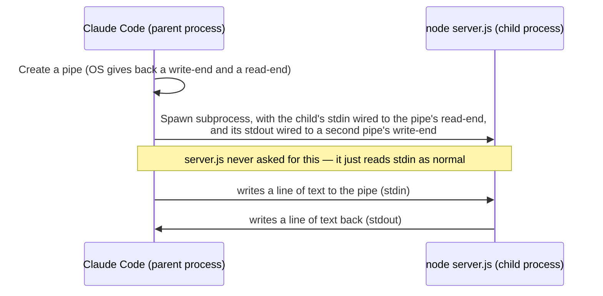

# What Even Is an MCP Server? Building a Mental Model With a Real One
{: .no_toc }

<details closed markdown="block">
  <summary>
    Table of contents
  </summary>
  {: .text-delta }
- TOC
{:toc}
</details>

I'd been using MCP servers inside Claude Code for a while -- Notion, Google Drive, a handful of others -- without ever really asking how "Claude calls a tool" actually works under the hood. That changed when I built and reviewed a real one: a small MCP server that wraps the Acuity Scheduling API, so Claude Code can list appointments, check availability, and book/cancel/reschedule directly from a chat. [The repo is public](https://github.com/walakaka77/acuity-mcp), so every code snippet in this series is something you can go read yourself, not a hypothetical.


This series is a write-up of everything that turned out to be non-obvious while building a mental model of that server -- including a couple of assumptions I made along the way that turned out to be flat wrong. I'm keeping those in rather than editing them out, because the wrong turn is usually more instructive than the correct answer on its own.

{: .note }
If you're coming at "AI agent architecture" from the workflow-orchestration side instead -- how to fan agents out safely, gate approvals, handle a platform's rough edges -- the [AI workflow series earlier in this section](/tech-adventures/general-tech/ai-concurrent-agent-workflow) covers that ground. This series is about the wire-level mechanics of how an agent calls a tool at all, one layer further down.

## The starting question

Claude Code can call a tool named `create_appointment` and a real appointment shows up on a real calendar. Concretely, what *is* the thing making that happen? Not "an MCP server," as a label -- what is it, physically, on my laptop, and how does a request actually get from Claude Code's process into a piece of code I wrote?

The honest answer took a few wrong turns to arrive at, so let's walk it the same way.

## Two processes, and a hard wall between them

The first fact that matters, and the one everything else follows from: **Claude Code and the MCP server are two separate operating-system processes.** When Claude Code needs to use the `acuity` server, it runs `node server.js` as a subprocess and keeps it alive for the session.



That question mark matters more than it looks like it should. Two separate OS processes have **separate, walled-off memory** -- this is a hard boundary the operating system enforces, not a design choice either program made. Claude Code cannot see or touch a JavaScript function sitting in `server.js`'s memory. There is no mechanism, no syscall, that lets one process "just call" a function living in another process's address space. If you've never needed to think about this before, it's worth sitting with: **there is no way, in the most literal sense, for these two programs to communicate by default.** Something has to bridge that gap on purpose.

## The bridge: pipes, and the three channels every process already has

The bridge turns out to be one of the oldest, plainest mechanisms in computing, dating back to 1970s Unix and inherited by every modern OS since (Windows included, via its own equivalent API): every process, the instant it's created, is handed three numbered communication channels by the kernel, before its own code even starts running:

| Channel | Number (file descriptor) | Purpose |
|---|---|---|
| stdin | 0 | where the process *receives* input |
| stdout | 1 | where it *sends* normal output |
| stderr | 2 | a separate channel just for error output |

"stdio" is just the umbrella term for these three. Critically, a process never sets these up itself -- it just finds them already there and reads/writes to them, unaware of what's actually plugged into the other end. Here's the proof, run two ways:

```bash
echo "hello from a pipe" | node -e "console.log('fd:', process.stdin.fd, 'isTTY:', process.stdin.isTTY)"
# fd: 0  isTTY: undefined
```

Same `fd: 0` every time, no matter what's connected to it -- a keyboard, a file, or another program entirely. The number never changes; only the wiring behind it does.

{: .important }
**stdin/stdout/stderr are not something a program builds or exposes.** They're handed to every process by the OS at birth. The only question that ever varies is *what's plugged into them*, and that's decided by whoever *starts* the process -- never by the process itself.

A **pipe** is the mechanism for wiring one process's stdout directly into another process's stdin, with no file or manual typing in between. Your shell's `|` character does exactly this:

```bash
cat file.txt | grep "hello"
```

`cat`'s stdout gets connected straight to `grep`'s stdin by the shell, before either program runs. Claude Code does the identical thing programmatically when it starts `server.js`: it creates a pipe, then spawns the subprocess with that pipe's ends wired to the child's stdin/stdout, instead of a terminal. `server.js`'s own code never had to ask for this or know it happened -- it just reads `process.stdin` like any command-line program would, exactly as in the demo above.



## Why not just... HTTP?

This was my first wrong assumption to check, and it's worth stating plainly why it doesn't apply here. HTTP exists to solve a problem neither of these two processes actually has: **finding and addressing a machine that could be anywhere on a network.** It needs a network address, a port, a TCP handshake, headers, a URL path, a status code -- all of that machinery exists because the two ends of an HTTP request might be continents apart.

Here, both "machines" are the same laptop, running two programs at the same time. There's nothing to address, nothing to route, no reason to open a network socket at all. The OS just wires one process's output directly into another's input -- a private, local, no-network conversation the outside world can't see or reach. That's the whole reason `server.js` runs the moment Claude Code needs it and dies the moment the session ends: it's not a background service listening for connections, it's a subprocess with a pipe, and pipes close the instant either end goes away.

## Where this series goes next

Knowing there's a pipe explains *how* two processes can exchange bytes. It says nothing yet about *what* those bytes actually look like -- a pipe is just a wire; it has no concept of "requests," "tools," or "JSON." That's the actual protocol layer, and it's where the genuinely interesting mechanics live: how Claude Code says "call `create_appointment` with these arguments," how the server answers back with the right response and not someone else's, and why a whole SDK exists on top of what's "just" a pipe. That's [next in this series](/tech-adventures/general-tech/mcp-json-rpc-tool-discovery).

Until next time, peace and love!
