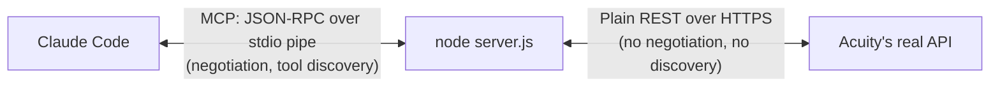

# The Other Half of the Bridge: How an MCP Server Actually Talks to a Real API
{: .no_toc }

<details closed markdown="block">
  <summary>
    Table of contents
  </summary>
  {: .text-delta }
- TOC
{:toc}
</details>

The [previous two posts](/tech-adventures/general-tech/mcp-json-rpc-tool-discovery) covered the Claude Code ↔ `server.js` hop in detail: pipes, JSON-RPC, capability negotiation, tool discovery. At that point I had a reasonably solid mental model -- solid enough that I made a confident, wrong extrapolation: I assumed the *same* negotiation pattern continued one hop further, all the way to Acuity itself. It doesn't, and untangling why turned out to be the most useful correction in this whole investigation.

## The wrong assumption, stated plainly

Having just learned that `server.js` discovers its tools by asking Claude Code what it supports, and that tools get advertised via a `tools/list`-style mechanism, it felt natural to assume Acuity worked the same way from the other side -- that `server.js` "reaches out to Acuity to check the list of tools available," and that Acuity, being an API a piece of software talks to, must "expose tools" in some comparably standard way.

That's not what happens, and the actual chain looks like this:



Only the *left* hop has anything to do with MCP, tools, schemas, or negotiation. The *right* hop is a completely different, much older, far more common kind of connection: **an ordinary REST API over HTTPS** -- the same category of thing a browser uses to load a page or `curl` uses to fetch a URL. Acuity has never heard of MCP. It does not know what a "tool" is. There is no capability exchange with `server.js` at any point.

## So where did the tool definitions come from?

Not from Acuity, dynamically. **A person read Acuity's own developer documentation and hand-translated a small slice of it into MCP tool definitions**, once, ahead of time. I confirmed this by actually checking what Acuity's documentation looks like:

{: .important }
Acuity's docs at `developers.acuityscheduling.com` are the traditional kind -- prose descriptions, example JSON payloads, an HTTP method and URL per endpoint -- plus, notably, an `llms.txt` index specifically aimed at AI agents, pointing to Markdown-formatted pages and an OpenAPI spec. That's real, and it's a genuinely standard thing (OpenAPI is a widely-used machine-readable format for describing a REST API's shape). But it has nothing to do with MCP, tools, or Claude specifically -- it predates MCP and would exist regardless.

There is no live check-in at server startup where `server.js` asks Acuity "what's available." If Acuity shipped a new endpoint tomorrow, this server would know nothing about it until a human read the new docs and wrote a new tool by hand. The tool list is frozen, hand-curated knowledge -- not something fetched at runtime, and not something Acuity itself produced.

{: .warning }
Reverse the causality here if you take one thing from this post: Acuity isn't exposing tools that happen to get informally documented. It's a REST API with ordinary documentation, predating MCP entirely. The "tools" only exist because a developer did translation work by hand, once. (Some companies *do* now ship their own official first-party MCP servers -- Notion and Google Drive are more likely examples of that. This Acuity server is an unofficial, third-party wrapper someone built after reading the public docs, not an official Acuity product.)

## The actual translation, end to end

Here's the real code, from the public repo, for one tool -- `create_appointment` -- covering both the "expose it to Claude Code" step and the "turn it into a real HTTP request" step.

**Exposing the tool** ([server.js](https://github.com/walakaka77/acuity-mcp/blob/main/server.js)):

```javascript
accountTool(
  "create_appointment",
  {
    description: "Book a new appointment on the live Acuity calendar...",
    inputSchema: {
      appointmentTypeID: z.number().int(),
      datetime: z.string().describe("ISO 8601 datetime, e.g. 2026-08-10T14:00:00+08:00"),
      firstName: z.string(),
      lastName: z.string(),
      email: z.string(),
      phone: z.string().optional(),
      calendarID: z.number().int().optional(),
      notes: z.string().optional(),
      timezone: z.string().optional(),
    },
  },
  ({ account, ...body }) => acuityRequest("POST", "/appointments", { body, account })
);
```

The `inputSchema` fields are exactly the fields Acuity's own documentation says a create-appointment payload needs -- someone read that page and wrote this. The handler itself is one line: destructure `account` out, pass everything else straight through as the request body.

**Crafting the real request** ([lib/acuity-client.js](https://github.com/walakaka77/acuity-mcp/blob/main/lib/acuity-client.js)):

```javascript
export const API_BASE = "https://acuityscheduling.com/api/v1";

export async function acuityRequest(method, path, { query, body, account } = {}) {
  const { userId, apiKey } = resolveCredentials(account);
  const url = new URL(API_BASE + path);
  const auth = Buffer.from(`${userId}:${apiKey}`).toString("base64");

  const response = await fetch(url, {
    method,
    headers: { Authorization: `Basic ${auth}`, "Content-Type": "application/json" },
    body: body === undefined ? undefined : JSON.stringify(body),
  });
  // ...parse response, throw readable errors on non-2xx...
}
```

For `create_appointment`, that resolves to: look up the named account's stored credentials, build `https://acuityscheduling.com/api/v1/appointments`, base64-encode `userId:apiKey` into an `Authorization: Basic` header (a standard, old HTTP auth scheme -- not anything invented for this project), and POST the JSON body. **This is the one point in the entire flow that leaves the machine and touches the real internet.** Everything on the Claude Code side of it was local pipe traffic; this step alone is a genuine outbound HTTPS call.

Cancellation shows the same function handling a different shape:

```javascript
({ id, account, ...body }) => acuityRequest("PUT", `/appointments/${id}/cancel`, { body, account })
```

Two details worth noticing: the method is `PUT`, not `POST`, purely because that's what Acuity's docs specify for this particular action -- there's no universal rule here, just whatever the target API decided. And the appointment `id` gets spliced directly into the URL path (`/appointments/123456/cancel`) rather than sent in the body -- a common REST convention where "which resource" lives in the path and "extra detail" lives in the body. One shared `acuityRequest` function handles every tool in the file; only the method, path, and body/query differ per tool.

## Two lessons that only showed up from actually using it

**A `200 OK` doesn't prove a mutation happened.** The repo's own README documents a real bug: `reschedule_appointment` originally called `PUT /appointments/:id`, which returned a clean `200` and echoed back the appointment -- unchanged. Acuity silently ignored the `datetime` field on that particular endpoint. The fix was switching to the dedicated `PUT /appointments/:id/reschedule` route. The lesson generalizes past this one bug: for any mutating call, a success status code only proves the request was well-formed enough to be accepted, not that the state you asked to change actually changed. Always re-fetch and check.

{: .note }
Real (sandbox) output, lightly redacted, from actually calling this server -- `list_calendars` against a test account:
```json
[
  { "id": 14456496, "name": "Qiai Chong", "timezone": "Asia/Singapore" },
  { "id": 14457622, "name": "Shafik Calendar", "timezone": "Asia/Singapore" }
]
```
Replying-address fields were stripped from this excerpt before publishing -- they identify a real person's account, and calendar IDs/names alone are enough to show the call actually worked.

**A `403` and a `401` mean very different things.** Acuity gates API access by plan tier -- some plans get `403: API access is only available on Powerhouse plans` on *every* call. Basic Auth still succeeded (that's why it's `403`, not `401`) -- Acuity's own layer is rejecting the request, not this server's code. This repo's `production` account actually hits this; a separate `sandbox` (Business-plan trial) account doesn't, which is why every real API call shown in this series came from `sandbox`.

## Multi-account, by design, not by accident

One more piece worth naming since it shows up throughout the code: this server supports multiple named Acuity accounts (`production`, `sandbox`, ...) side by side, resolved per tool call:

```
1. ACUITY_USER_ID + ACUITY_API_KEY env vars — direct override
2. `account` argument on the call, or ACUITY_ACCOUNT env var — looked up by name
3. accounts.json's own "default" account
4. accounts.json with exactly one account — used automatically
5. legacy single-account credentials file
```

This entire resolution order is this project's own invention, layered on top of Acuity's API -- Acuity itself has no concept of "named accounts" from an integration's perspective; it just authenticates whatever `userId:apiKey` pair shows up in the header.

## Where this series goes next

At this point, the server works, and I understand both hops of how. The last thing left is the part that matters before anyone else can use it: is it actually safe to make this repo public, and how would you check? That's a security review, done for real against this exact repo, [next in this series](/tech-adventures/general-tech/mcp-server-security-review).

## Images Required

None for this article — it's real code and real (redacted) API output throughout.

Until next time, peace and love!
