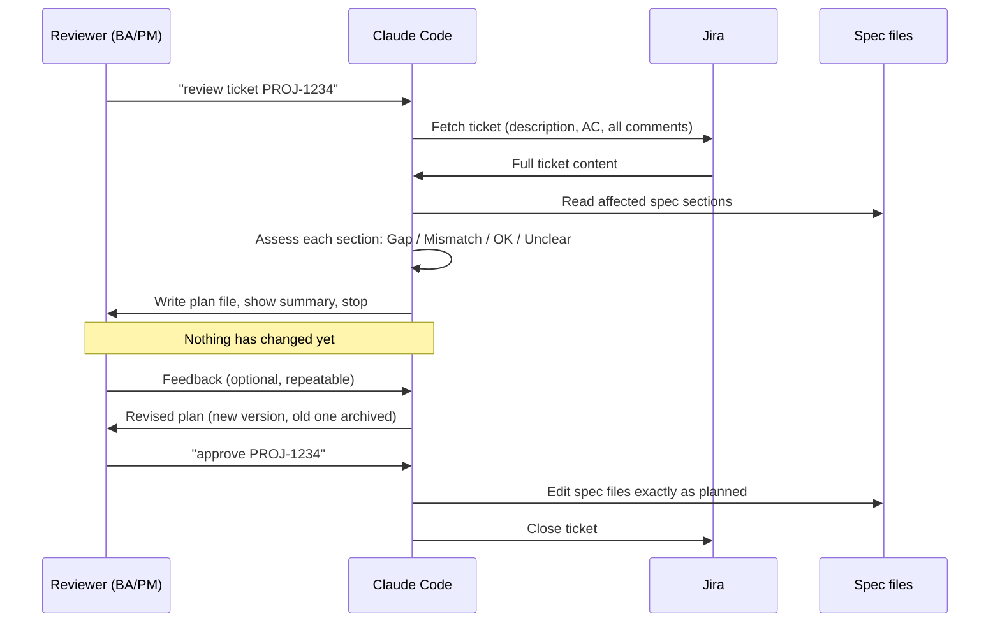
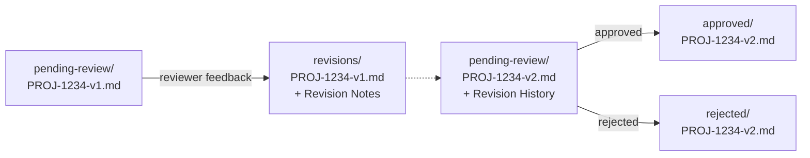

# Building an Approval-Gated AI Workflow for Updating Functional Specs
{: .no_toc }

<details closed markdown="block">
  <summary>
    Table of contents
  </summary>
  {: .text-delta }
- TOC
{:toc}
</details>

I do business-analyst work on a client project where the deliverable is a set of **Functional Specifications (FS)** -- the documents that describe, section by section, exactly how a piece of regulated software is supposed to behave. Every ticket that changes behaviour is supposed to update the matching FS section. In practice, "supposed to" is where these things usually fall apart: specs drift from reality, updates get skipped under deadline pressure, and six months later nobody can reconstruct *why* a section reads the way it does.

I set out to fix that with Claude Code, but the constraint that shaped everything else was this: the people reviewing tickets and proposing spec changes are Business Analysts and PMs who don't know git and shouldn't need to. Whatever I built had to feel like a conversation, not a coding session -- while still producing something as rigid and auditable as a real change-control process.

{: .note }
Everything below is genericised. No client name, project codenames, ticket numbers, or internal field IDs appear anywhere in this article -- the mechanics are what's worth sharing, not whose spec it is.

## The core design decision: propose, don't edit

The single most important rule in this workflow is also the simplest one: **the AI is never allowed to edit a spec file directly from a ticket.** It can only write a *plan* describing what it would change. A human reads that plan, and only once they explicitly approve it does a second command actually touch the spec.



That gap between "plan written" and "plan approved" is the entire point of the design. It means a reviewer can read the AI's reasoning in plain English, in a normal markdown file, before a single line of the actual spec changes -- and it means the AI is structurally incapable of quietly rewriting a regulated document on a bad inference.

## What a plan file actually contains

Each plan is one markdown file with a fixed shape: a header block, a revision history, the AI's read of the ticket, its section-by-section assessment, and an explicit list of open questions.

```markdown
# Update Plan — PROJ-1234

**Ticket summary:** ...
**Plan status:** Pending Review
**FS changes required:** Yes / No
**Version:** v1
**Created:** {date}

## Revision History
- v1 ({date}): Initial draft

## Ticket Analysis
**Current behaviour:** ...
**Expected behaviour:** ...
**Acceptance criteria:** ...

## FS Assessment
### {spec-section-file} — Gap / Mismatch / Inferred OK / Unclear
**Reason:** ...
**Before:** > ...
**After:** > ...

## Affected Test Cases
- {test file} — {what needs creating or updating}

## Questions for Reviewer
1. ...

## Validation Checks
- [x] Ticket fetched, all comments read
- [x] AC extracted, source noted
- [x] Relevant spec sections identified and read
- [x] Gap/mismatch assessed for each section
```

Two fields do a lot of quiet work here:

- **`FS changes required: No`** is a legitimate outcome, not a failure to find anything. Sometimes a ticket turns out to be a bug fix that the spec already correctly describes -- the plan still gets written and still goes through approval, because *that itself* is the audit record confirming someone checked.
- **Questions for Reviewer** exists so the AI has a structured place to say "I don't know" instead of guessing. If the spec is silent or ambiguous on something the ticket needs, that goes here -- not into an invented assumption buried in the "After" text.

{: .important }
A plan with unresolved questions cannot be approved. The approval step reads this section first and refuses to proceed -- with the exact list of what's still open -- if anything is unanswered. There's no "approve anyway" override.

## Versioning instead of overwriting

The second hard rule: **a pending plan is never edited in place, no matter how the reviewer phrases the request.** "Update the plan," "just fix v1," "here's the corrected version" -- all of these produce the same action: archive the current version, write a new one.



The archived version gets a **Revision Notes** section appended -- what the reviewer said, and what changed because of it. The new version's **Revision History** carries that forward. The intent is specifically that someone with zero access to the original chat conversation should be able to open `v1` in `revisions/`, then `v2` in `approved/`, and reconstruct the entire decision -- not just what changed, but *why*.

{: .note }
This is the same reason commit history exists in software -- except the audience here is a compliance reviewer, not a developer, so the "commit messages" have to be full sentences a BA can read cold.

## Why this shape, specifically

A few things about this design weren't obvious until they got tested against real tickets:

- **The plan file is the source of truth, not the chat.** Claude writes the file *before* showing a summary in the conversation. If the file and the chat ever disagree, the file wins -- because the file is what persists and what gets reviewed later.
- **"Never guess" needed to be a structural rule, not a style preference.** Early on, ambiguity in a ticket would get silently resolved by inference. Moving that into a numbered Questions section made the ambiguity visible instead of invisible -- which is the entire value of having a human in the loop at all.
- **Approval has to be a distinct, named action** (`/approve-fs`, in this case) rather than "proceed" typed into chat. A named command is unambiguous about intent and is where every downstream side effect -- editing files, creating tests, closing the ticket -- is anchored. Interpreting a casual "go ahead" and manually replicating the steps is exactly how a step like the Jira transition quietly gets skipped.

## Images Required

None for this article — it's diagram- and code-based throughout.

Until next time, peace and love!
