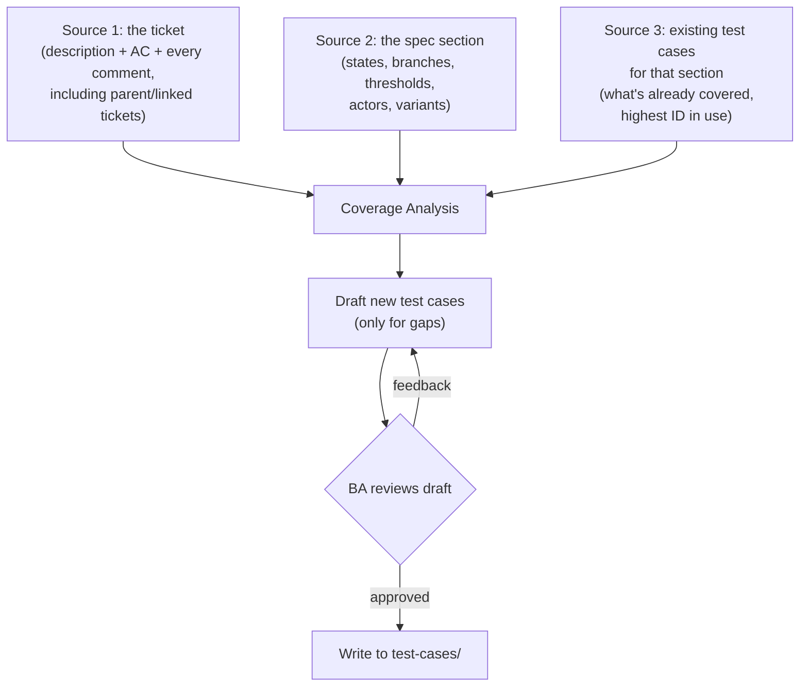
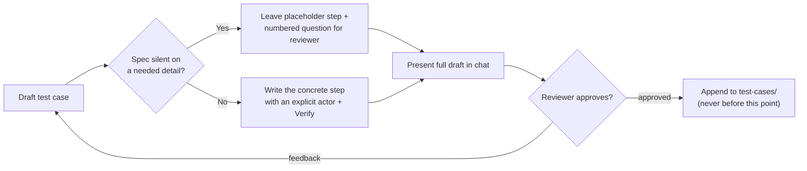

# Teaching an AI Agent to Write Test Cases That Don't Collide
{: .no_toc }

  

    Table of contents
  

  {: .text-delta }
- TOC
{:toc}

Once a [functional spec gets updated](/tech-adventures/general-tech/ai-spec-update-workflow), the natural next question is: does the test suite still describe reality? On the client project this workflow was built for, test cases live as plain markdown files that mirror the spec's own section structure -- one test file per spec section, so anyone can find "what should I test for section 7.2" without a separate index.

The problem worth solving wasn't "can an AI write test cases" -- it clearly can. It was **can it write test cases that don't quietly duplicate, contradict, or corrupt an existing suite that a human built up over months.** That turned out to need three things: reading from more than one source before writing anything, a tagging system that says *why* a test case exists, and a strict draft-then-approve gate identical in spirit to the spec workflow.

{: .note }
Genericised throughout -- no real ticket numbers, client name, or internal field IDs. The mechanics are the point.

## Two ID formats, and why they must never mix

Before the tagging problem, there's a simpler one: this project actually has **two independent test case ID systems** living in the same folder, tracking two different things.

| Format | Example | Who assigns it | What it means |
|---|---|---|---|
| Legacy regression ID | `PROJ-TC-1049` | Migrated from an older test-management tool | Tied to an automated regression suite. Always references its automation script. |
| Section-based ID | `TC-07-02-03-001` | The AI workflow, on approval | `07-02-03` mirrors the spec file number; `001` is the sequence within that section. Manual/BA-authored. |

The rule is simple to say and easy to get wrong in practice: **every new test case written through this workflow uses the section-based format, full stop.** The legacy format is frozen -- reserved for whatever the automation suite already owns. Mixing them would mean two ID spaces silently colliding, and losing the one thing an ID is supposed to guarantee: that it uniquely and permanently points at one thing.

## Reading three sources before writing one test case

The workflow refuses to draft anything until it has read all three of these, every time:

Each source answers a question the others can't:

- **The ticket** tells you what actually broke or changed -- and specifically, what a *human* already flagged as a boundary worth testing (a time cutoff, a payment variant, an actor difference).
- **The spec section** is the actual source of truth for *what should exist to test*. Distinct states become one test case per transition; conditional branches become one per branch; a described threshold becomes a test case on each side of it.
- **Existing test cases** exist purely to prevent duplication -- what's already covered doesn't get redrafted, and the next ID in sequence gets picked up correctly instead of colliding with something already written.

{: .warning }
A real lesson from this project: a ticket's root cause once turned out to live only in a *parent* ticket's comments, not in the ticket being worked on at all. A diff-only read of the immediate ticket produced test cases that missed the actual boundary condition entirely. The fix wasn't cleverness -- it was a hard rule: always read every comment, and always follow parent/linked tickets, before drafting anything.

## A tag for every reason a test case exists

Every test case gets exactly one tag, and the tag is a claim about *why the test case exists*, not just a category label:

| Tag | Meaning |
|---|---|
| `[REGRESSION]` | Runs every time, in the standing weekly suite. Promoted here deliberately, through review -- not assigned casually. |
| `[SECONDARY]` | A supplementary flow the spec describes but that isn't part of core regression -- a threshold boundary, a payment-method variant, a partial-vs-all condition. |
| `[TICKET]` | Behaviour surfaced specifically by a ticket. If it's a sanity check confirming a fix didn't leak into adjacent behaviour, the test case body says so explicitly. |
| `[EDGE CASE]` | A genuinely rare permutation -- valid, but infrequent enough that it's excluded from routine runs. Used sparingly, and never as a catch-all for anything merely inconvenient to classify. |

The tag placement matters as much as the tag itself. A time-boundary test case names the boundary in its own heading (`-- before T+30` vs `-- after T+30`), not buried in a step -- because two test cases either side of the same threshold need to read as obviously distinct at a glance, not as near-duplicates someone might merge by mistake later.

## Writing rules that turn "vibes" into something checkable

The workflow enforces a short list of hard formatting rules on every test case, specifically because "write good test cases" is not a checkable instruction on its own:

- Every step names its actor explicitly -- *as Applicant*, *as Officer*, *as System* -- so a reviewer never has to guess who's doing what.
- Every step with a verifiable outcome ends in an explicit **Verify** statement naming the *exact* target state, not a paraphrase of it.
- A time-dependent test case states its boundary explicitly, in the heading or the step -- "after expiry" is rejected; "at T+30 from the due date" is accepted.
- If the spec is silent on a detail a step needs, that becomes a numbered question for the reviewer, with a placeholder left in the draft -- never an invented behaviour.

{: .important }
Nothing gets written to the actual test-case files until the reviewer explicitly approves the draft in chat. Every draft is presented first, in the exact format the real files use, so what the reviewer approves is what actually lands on disk -- no gap between "what I agreed to" and "what got written."

## Images Required

None for this article — it's diagram- and table-based throughout.

Until next time, peace and love!
