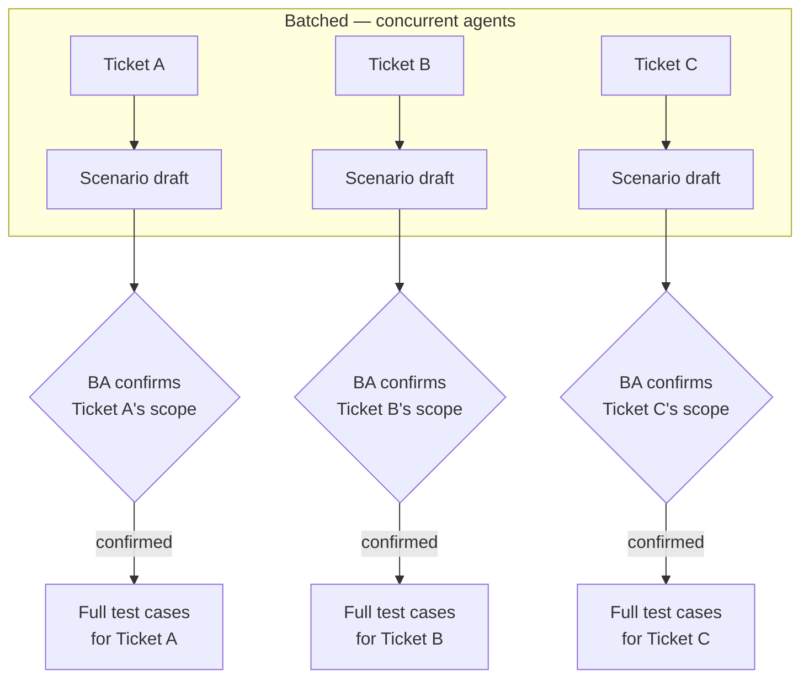
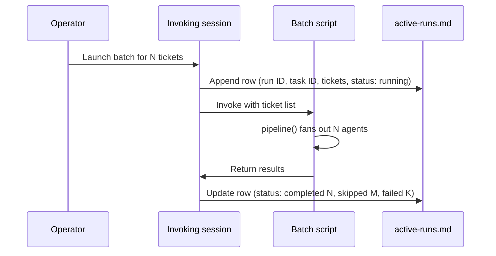

# Running Concurrent AI Agents Safely: Lessons from a Real Batch Workflow
{: .no_toc }

<details closed markdown="block">
  <summary>
    Table of contents
  </summary>
  {: .text-delta }
- TOC
{:toc}
</details>

The [test-case drafting workflow](/tech-adventures/general-tech/ai-test-case-update-workflow) works well one ticket at a time. The problem is that "one ticket at a time" doesn't scale when a dozen tickets are sitting in a backlog waiting for the same cheap first step -- a scenario draft, just scoping out *what* should be tested, before anyone commits to writing full test case bodies.

This post is about building the concurrent version of that step: a script that fans an AI agent out across many tickets in parallel, and the real things that broke -- and what they taught -- getting it from "designed" to "verified against a real run."

{: .note }
Genericised throughout. Ticket IDs below are placeholders; no real ticket numbers or client identifiers appear.

## What gets batched, and what deliberately doesn't

Only the *cheap* stage gets batched: drafting a one-line-per-scenario scope list for each ticket. Writing the full test case body -- steps, preconditions, exact expected outcomes -- stays a one-ticket-at-a-time, human-approved step, run separately for each ticket only after that ticket's scope has been confirmed.



{: .important }
Confirmation is never batched, on principle. A batch run can produce ten scenario drafts at once, but each one still needs its own explicit "confirmed" from a human before the next stage runs for it. Concurrency is a property of the cheap, reversible step -- not of the approval gate.

## The pipeline, and its idempotent skip

The actual script is short: a list of ticket IDs goes in, and each one runs through the same set of steps as a single-ticket run -- check first, then draft:

```javascript
const tickets = Array.isArray(args) ? args : JSON.parse(args)

const results = await pipeline(
  tickets,
  async (ticketId) => agent(
    `Step 0 — Idempotent check:
     If a scenario draft already exists for ${ticketId} in pending-review/
     or approved/, return { status: "already_exists" } immediately.

     Step 1 — Otherwise, follow the scenario-drafting skill exactly,
     and write the draft file.`,
    { schema: resultSchema }
  )
)
```

That idempotent check matters more than it looks like it should. A batch of a dozen tickets is exactly the kind of run someone re-launches after a partial failure, or re-runs by habit to "make sure." Without the check, a re-run silently duplicates or overwrites drafts a reviewer might already be halfway through reading. With it, re-running the same batch twice is simply safe -- already-drafted tickets report `already_exists` and nothing changes.

## The bug: args arrived as a string, not an array

The first real run failed instantly, every time, with `TypeError: pipeline() expects an array as the first argument` -- despite the ticket list being passed in as a proper array at the call site. The actual cause: on some invocation paths, the array arrives inside the script serialised as a JSON string rather than as a native array. The script was trusting its input's type instead of checking it.

```javascript
// Defensive: some invocation paths deliver args as a JSON-encoded string
// rather than a native array — normalise before use.
const tickets = Array.isArray(args) ? args : JSON.parse(args)
```

{: .warning }
One line, but it's the difference between a workflow that's actually reliable and one that fails unpredictably depending on how it happens to get invoked. If you're building anything on top of a platform-provided orchestration primitive, don't assume its documented input shape survives every code path that can call it -- check, don't assume.

## The limitation that couldn't be fixed in the script

The next question, once batches started actually running, was an operational one: if a 12-ticket batch hangs or needs interrupting, how does anyone find the run to check on it or stop it?

The instinct was to have the script log its own run identifier somewhere durable. That turned out to be impossible, not for lack of trying:

{: .note-title }
> A hard platform constraint, not a design choice
>
> A workflow script has no access to its own run identifier or task identifier from inside its own body. Both are assigned by the orchestrating layer *after* the script is invoked, and are only ever handed back to whoever launched it -- never to the script itself. There is no variable inside the script that exposes them.

The workaround moved the responsibility up a level instead of trying to solve it down in the script: the *invoking* session -- not the script -- writes a row to a plain tracked file the moment a batch is launched (start time, run ID, task ID, the ticket list, status `running`), and updates that same row when the batch finishes. Anyone who needs to check on or resume a run reads that one file instead of hunting through session history or app-data folders.



This is a small pattern with a bigger lesson underneath: when a platform genuinely doesn't expose something you want, the fix often isn't to fight the platform for it -- it's to relocate the responsibility to whichever layer *does* have the information, and make that layer write it down.

## What "concurrent" actually looked like in practice

One more thing worth flagging, because it's counter-intuitive if you're picturing a progress bar: on a real 4-ticket run, all four agents started at nearly the same instant (nowhere near the concurrency cap), but finished in a different order than they started, and the only signal back to the operator was a single notification once the *entire* batch -- all agents plus the summary write -- had completed. There is no built-in per-ticket "this one just finished" notification.

That's expected behaviour, not a bug, for a batch small enough to stay under the concurrency ceiling. It just means "concurrent" here reads as "all start together, finish independently, report together" -- not as a live progress feed. If real-time visibility into individual completions is ever needed, that's a job for a separate watcher process, not something the batch script itself provides.

## Images Required

None for this article — it's diagram- and code-based throughout.

Until next time, peace and love!
