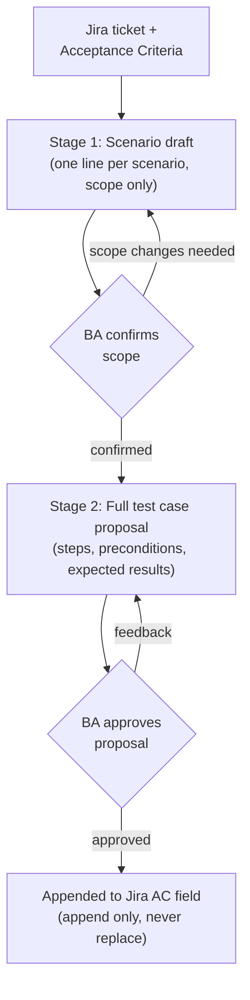
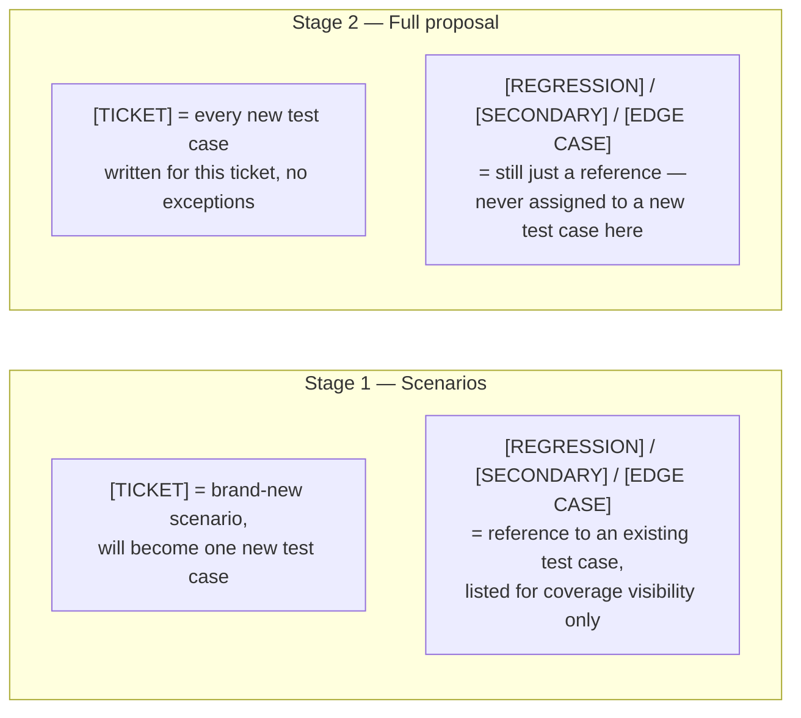

# From Acceptance Criteria to Test Cases: A Two-Stage AI Review Workflow
{: .no_toc }

  

    Table of contents
  

  {: .text-delta }
- TOC
{:toc}

The [test case workflow](/tech-adventures/general-tech/ai-test-case-update-workflow) covers writing test cases into the permanent suite. There's a related but distinct problem: some tickets need their **Acceptance Criteria in Jira itself** enriched with concrete test cases -- so a tester or stakeholder reading the ticket sees exactly what "done" means, without leaving Jira to go find a separate test file.

The naive version of this is one AI command: read the ticket, write full test cases, append them to Jira. The actual workflow deliberately splits that into two stages, because the naive version has an expensive failure mode -- a reviewer disagreeing with the *scope* only after reading through fully-written test case bodies, steps and all, forcing a full rewrite over what was really just a scoping disagreement.

{: .note }
Genericised throughout -- ticket IDs and field names below are placeholders, not real identifiers.

## Why scope gets confirmed before anything expensive gets written

The fix is to make disagreeing about scope cheap. Stage one produces a one-line-per-scenario list -- just enough for a reviewer to say "yes, test that" or "no, that's out of scope" -- with none of the step-by-step detail that stage two eventually adds.

Each new scenario in stage one becomes exactly one new test case in stage two -- a 1:1 mapping that makes "how big is this proposal going to be" predictable from the scenario count alone, before any of the expensive writing happens.

## Reusing coverage instead of re-deriving it

Both stages need to know what already exists -- which test cases already cover part of this ticket's behaviour, so nothing gets proposed twice. The scenario stage builds that picture once, and the full-proposal stage explicitly *inherits* it rather than re-reading everything from scratch:

| | Stage 1 (Scenarios) | Stage 2 (Full proposal) |
|---|---|---|
| Reads the ticket + spec in full | Yes | Yes (needed for step-level detail) |
| Re-reads all existing test files for coverage | Yes -- builds the table | **No** -- inherits Stage 1's table |
| Produces | One-line scenarios, tagged | Full step-by-step test cases |
| Output location | Scenario drafts folder | Test-case proposal folder |
| Gate | BA confirms scope | BA approves full proposal |

Skipping the re-read in stage two isn't just an optimisation -- it's a correctness guarantee. If both stages independently re-derived coverage, they could disagree with each other on a fast-moving ticket where a test file changed in between. Inheriting the same table means both stages are provably looking at the same picture of what already exists.

## A tag can mean two different things depending on the stage

This is the single most easily-missed subtlety in the whole design: **the same tag means something different depending on which stage produced it.**

In other words: **every genuinely new test case is `[TICKET]`, in both stages, always.** The other three tags only ever point at test cases that already exist elsewhere in the permanent suite -- they show up here purely so a reviewer can see the full coverage picture in one place, not because a new test case was just created with that label. Classification into `[REGRESSION]` / `[SECONDARY]` / `[EDGE CASE]` only happens later, when a test case is promoted into the permanent suite through a separate, deliberate review -- never automatically, and never at proposal time.

{: .warning }
Getting this backwards -- tagging a brand-new test case `[REGRESSION]` because it *feels* important, for instance -- would misrepresent it as something that already exists and is already part of the standing suite. The rule exists specifically to keep "new" and "existing" impossible to confuse at a glance.

## Append-only, never replace

The last safeguard is about what happens at the very end, when an approved proposal actually touches Jira: it is **appended** to the ticket's Acceptance Criteria field, never used to replace whatever's already there.

{: .important }
This matters because the AC field is often where the original requirement lives, sometimes written by someone who is no longer on the project. Overwriting it in the name of "cleaning it up" would destroy the original intent behind the ticket. Appending preserves both: the human-authored original criteria, and the AI-drafted test cases that operationalise them -- clearly marked as generated, with a date, so anyone reading the ticket later can tell the two apart at a glance.

Put together, the shape of the whole thing is: cheap scope agreement first, full detail only after that's settled, coverage computed once and trusted twice, tags that never lie about whether something is new, and a Jira update that only ever adds. None of those individually are exotic ideas -- the value is in applying all of them together to something that would otherwise tempt a much simpler, much riskier one-shot design.

## Images Required

None for this article — it's diagram- and table-based throughout.

Until next time, peace and love!
